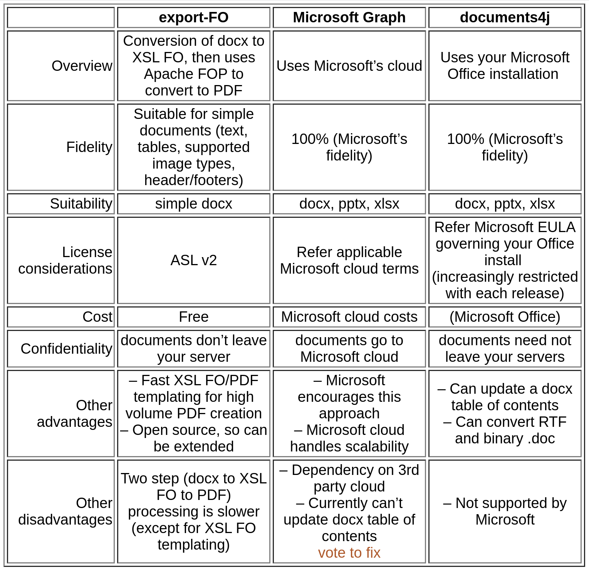
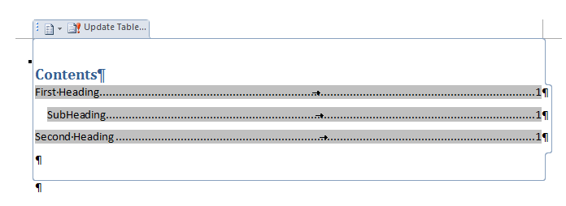

Docx4j - Getting Started

Contents

  


**This guide is for docx4j 17.2.1 (Java 11 and later); most of it applies to 11.5.x as well.   **

Version numbering jumped from 11.5.14 to 17.0.0 in part because of the following API changes:

- old methods getEGBlockLevelElts, getParagraphContent, getRunContent have been replaced with getContent; 
- ArrayListWml, ArrayListDml, ArrayListVml, and ArrayListMce have been replaced by a single ArrayListDocx4j class; 
- org.jvnet.jaxb2\_commons.ppp.Child is now org.jvnet.jaxb.lang.Child

This guide is also applicable for the most part to **8.3.x **which now in 2026 is considered obsolete.  The 8.x series was the last series to run under Java 1.8 (hence the name) 

The latest version of this document can always be found in [docx4j on GitHub in /docs](https://github.com/plutext/docx4j/tree/master/docs).

There is also a handy 1 page summary at [https://www.docx4java.org/docx4j/plutext-docx4j\_on\_a\_page-v300.pdf](https://www.docx4java.org/docx4j/plutext-docx4j_on_a_page-v300.pdf) (look out for an update soon).

# What is docx4j?

docx4j is a library for working with docx, pptx and xlsx files in Java.  In essence, it can unzip a docx (or pptx/xlsx) "package", and parse the XML to create an in-memory representation in Java using developer friendly classes (as opposed to DOM or SAX).  

docx4j is usually deployed as part of a web application (eg on Tomcat, JBOSS, WebSphere etc – see the deployment forums).

docx4j is similar in concept to Microsoft's OpenXML SDK, which is for .NET.  docx4j.NET is available for the NET platform; see further below.

A distinctive strength of docx4j is that its in-memory representation uses **JAXB**, the JCP standard for Java - XML binding.  Docx4j is the only library for working with OpenXML files which uses/supports JAXB (each of the Sun/Oracle, MOXy and IBM[^1] implementations).  In contrast, Apache POI uses XML Beans.  (Aspose in contrast, does not provide low-level access to the underlying XML or a corresponding object model, so "you can't do it" unless Aspose provides support for it).  

docx4j is open source, available under the Apache License (v2).  As an open source project, docx4j has been substantially improved by a number of contributions (see the README or POM file for contributors), and further contributions are always welcome.  Please see the docx4j forum at [http://www.docx4java.org/forums/](http://www.docx4java.org/forums/) for details.

The docx4j project is sponsored by Plutext ([www.plutext.com](http://www.plutext.com)).

There is also a commercial enterprise edition of docx4j, which comes with commercial support and additional functionality not found in the community edition.  Additional functionality includes:

- Merging documents or presentations
- OLE embedding of files in docx, pptx, xlsx
- Digital signatures

# What sorts of things can you do with docx4j?

- Open existing docx (from filesystem, SMB/CIFS, WebDAV using VFS), pptx, xlsx
- Create new docx, pptx, xlsx
- Programmatically manipulate the above (of course)
- Save to various media zipped, or unzipped
- Protection settings
- Produce/consume  the Flat OPC XML format
- Do all this on Android.

Specific to docx4j (as opposed to pptx4j, xlsx4j):

- Import XHTML
- Import and export Markdown (from 17.0.4), including TeX math to/from native equations
- Export as (X)HTML or PDF
- Template substitution; CustomXML binding
- Mail merge
- Apply transforms, including common filters
- Diff/compare documents, paragraphs or sdt (content controls)
- Font support (font substitution, and use of any fonts embedded in the document)

This document focuses primarily on docx4j, but the general principles are equally applicable to pptx4j and xlsx4j.

# Is docx4j for you?

Docx4j is for processing docx documents (and pptx presentations and xlsx spreadsheets) in Java.

It isn't for old binary (.doc) files.  If you wish to invest your effort around docx (as is wise), but you also need to be able to handle old doc files, see further below for your options. 

Nor is it for RTF files.

# GraalVM

Programs based on docx4j can be converted to a Graal native image, and run "serverless" on AWS Lambda.

# docx4j.NET

If you want to process docx/pptx/xlsx on the .NET platform, you should consider Microsoft's OpenXML SDK.  That said, docx4j can be used in a .NET environment via IKVM, and there are several reasons you might wish to do this:

- Where you need docx4j’s capabilities, for example:
  - XHTML import/export/roundtrip
  - PDF export
  - OpenDoPE processing
- Capabilities provided by docx4j enterprise edition (as to which see above)
- Where you need to work in both Java and .NET, and want to use a single API in both environments
- Where you need the source code (Microsoft doesn’t provide that)

You can use docx4j.NET and the OpenXML SDK together; see [InteropDocx](https://github.com/plutext/docx4j.NET/blob/master/docx4j.NET/src/samples/c%23/Docx4NET/InteropDocx.cs)

As on the Java platform, docx4j.NET comes in community and commercial editions.

See [https://www.nuget.org/packages/docx4j.NET/](https://www.nuget.org/packages/docx4j.NET/)

# What Word documents does it support?

Docx4j can read/write docx documents created by or for Word 2007 or later, plus earlier versions which have the compatibility pack installed. (Same goes for xlsx spreadsheets and pptx presentations).

Most docx files in the wild use the so called “transitional” namespace [http://schemas.openxmlformats.org/officeDocument/2006](http://schemas.openxmlformats.org/officeDocument/2006).  Office 2013 introduced the option of using the “strict” namespace [http://purl.oclc.org/ooxml/officeDocument](http://purl.oclc.org/ooxml/officeDocument); docx4j (from 11.5.9) can import these.  A strict package is converted as docx4j reads it, so what docx4j writes is always transitional: strict in, transitional out.

The relevant parts of docx4j are generated from the ECMA schemas, with the addition of the key Microsoft proprietary extensions.  For unsupported extensions, docx4j gracefully degrades to the specified 2007 substitutes.

It is not really intended read/write Word 2003 XML documents, although `package``  org.docx4j.convert.in.word2003xml  `is a proof of concept of importing such documents.

For more information, please see ***Specification versions*** below.

# Handling legacy binary .doc files

An effective approach is to use LibreOffice or OpenOffice (via jodconverter) to convert the doc to docx, which docx4j can then process.  If you need to return a binary .doc, LibreOffice or OpenOffice/jodconverter can convert the docx back to .doc.

With 8.2.0, docx4j can also convert binary .doc or RTF to docx, using Microsoft Word courtesy of documents4j.   The sub-projects docx4j-documents4j-local and docx4j-documents4j-remote provide an interface to documents4j which is convenient for docx4j users.

# A word about Jaxb

docx4j uses JAXB to marshall and unmarshall the XML parts in a docx/pptx/xlsx.

Docx4j supports 2 major JAXB implementations:

- the Sun/Oracle/"Reference" implementation; to use this you need docx4j-JAXB-ReferenceImpl

You can also use the JAXB reference implementation (eg v2.2.4).  If you want to use that in preference to the version included in the JDK, do so using the endorsed directory mechanism.

- Moxy.  To use this, you need docx4j-JAXB-MOXy.

There is also:

- the JAXB in Java 8 implementation; to use this, you need the docx4j-JAXB-Internal jar. You can also use this with Java 9.  But not Java 11, since Java 11 does not ship JAXB anymore.   
  
- IBM's (in WebSphere).  By default, WebSphere uses com.ibm.xml.xlxp2.jaxb, which has the concept of fallback/ MarshallerProxy.  The actual implementation it uses is in com.ibm.jaxb.tools.jar.

This table shows which docx4j versions align with JAXB spec versions:

|JAXB version|Namespace|Docx4j version|
|---|---|---|
|JAXB 4.0|jakarta.xml.bind|Docx4j 17.0.x<br>Docx4j 11.5.x|
|JAXB 3.0|jakarta.xml.bind|Docx4j 11.4.x|
|JAXB 2.x|javax.xml.bind|Docx4j to 11.3.2<br>Docx4j 8.x|

# Using docx4j via Maven

docx4j is in Maven Central.  For Maven users, this makes it really easy to get going with docx4j.  

As noted in the introduction, current release series are docx4j **11.5.x.** and **17.x**

To use docx4j 17.2.0, ensure any code references **jakarta.xml.bind** (not javax.xml.bind), and add **one and only one** of the following to your project:

&#9;	`<!-- use the JAXB Reference Implementation -->`

&#9;	`<dependency>`

&#9;		`<groupId>org.docx4j</groupId>`

&#9;		`<artifactId>``docx4j-JAXB-``ReferenceImpl``</artifactId>`

&#9;		`<version>``17.``2``.0``</version>`

&#9;	`</dependency>`

&#9;	

&#9;	`<!-- use the MOXy JAXB implementation -->`

&#9;	`<dependency>`

&#9;		`<groupId>org.docx4j</groupId>`

&#9;		`<artifactId>``docx4j-JAXB-``MOXy``</artifactId>`

&#9;		`<version>``17.``2``.0``</version>`

&#9;	`</dependency>`

The blog entry [hello-maven-central](http://www.docx4java.org/blog/2011/10/hello-maven-central/)s \[needs to be updated per above\] shows you what to do, starting with a fresh OS (Win 7 is used, but these steps would work equally well on OSX or Linux).

# Using docx4j binaries

If Maven is not for you, you can download the latest version of docx4j from [http://www.docx4java.org/docx4j/](http://www.docx4java.org/docx4j/)

Supporting jars can be found in the .tar.gz or zip version, or in the relevant subdirectory.  

You'll need the jars from one and only one of these directories: 

- docx4j-JAXB-Internal, 
- docx4j-JAXB-ReferenceImpl, 
- docx4j-JAXB-MOXy

# docx4j dependencies

## slf4j

To do anything with docx4j, you need **slf4j** on your classpath.  As the slf4j website puts it:

The Simple Logging Facade for Java (SLF4J) serves as a simple facade or abstraction for various logging frameworks (e.g. java.util.logging, logback, log4j) allowing the end user to plug in the desired logging framework at *deployment* time.

So you need the slf4j api jar on your classpath (which Maven should do for you automatically):

`  <``dependency``>`

`    <``groupId``>``org.slf4j``</``groupId``>`

`    <``artifactId``>``slf4j-api``</``artifactId``>`

`  </``dependency``>`

For anything to be logged, you need a logging implementation.  Here we assume you will use logback as your implementation:

`  <``dependency``>`

`    <``groupId``>`` ch.qos.logback`` </``groupId``>`

`    <``artifactId``>`` logback-classic`` </``artifactId``>`

`    <``version``>``${version.logback-classic}``</``version``>`

`  </``dependency``>`

For docx4j v11.4 on, the version property should be:

&#9;	`<version.logback-classic>1.``5.19``</version.logback-classic>`

For docx4j 8.3.8, use `logback-classic 1.2.10.`

A logback.xml config file may be found at [https://github.com/plutext/docx4j/blob/VERSION\_17\_2\_1/docx4j-samples-resources/src/main/resources/logback.xml](https://github.com/plutext/docx4j/blob/VERSION_17_2_1/docx4j-samples-resources/src/main/resources/logback.xml).  Put that on your classpath.

See for example [https://github.com/plutext/docx4j/blob/master/docx4j-samples-docx4j/pom.xml#L67](https://github.com/plutext/docx4j/blob/master/docx4j-samples-docx4j/pom.xml)

## other dependencies 

Depending what you want to do, the other dependencies will be required.

Best practice is to include all dependencies on your class path, and be done with it.  

In your development environment, you can do this using Maven, or by physically copying them all to your classpath.

For your deployment environment, your build process ought to be set up to do this for you.

# Docx4j source code

Docx4j source is on GitHub at [https://github.com/plutext/docx4j](https://github.com/plutext/docx4j) .  

We accept pull requests; pull requests are presumed to be contributions under ASLv2 per our contributor agreement.  

See [docx4j-from-github-in-eclipse](http://www.docx4java.org/blog/2012/05/docx4j-from-github-in-eclipse/) for details.

Source code can also be downloaded from Maven Central (search for docx4j at search.maven.org).

# Javadoc

Javadoc can be downloaded from Maven Central (search for docx4j at search.maven.org), but you’ll find the source code much more useful!  See above.

# Building docx4j from source 

Get the source code from GitHub (see above), then… (you probably want to skip down to the next page, to get it working in Eclipse).

docx4j builds on Linux, macOS and Windows (from 17.0.5).

## Command line -via Maven

```
export MAVEN_OPTS=-Xmx512m
mvn install  -Dgpg.skip=true
```

## Eclipse

See [docx4j-from-github-in-eclipse](http://www.docx4java.org/blog/2012/05/docx4j-from-github-in-eclipse/).

Not working?

Enable Maven (make sure you have Maven and its plugin installed - see Prerequisites above):

- with Eclipse Indigo
  - Right click on the project
  - Click "Configure \> Convert to Maven Project"

compiler version \& system library:

- Right click on the project (or Alt-Enter)
- Choose "Java Compiler", then set JDK compliance to 1.8
- Choose "Java Build Path", and check you are using 1.8 "JRE System Library". If not, remove, then click "Add Library"

The project should now be working in Eclipse without errors[^2]. 

## Using a different IDE?

Please post setup instructions in the forum, or as a wiki page on GitHub.  Thanks!

# Open an existing docx/pptx/xlsx document

[`org.docx4j.openpackaging.packages.``WordprocessingMLPackage`](http://dev.plutext.org/trac/docx4j/trac/docx4j/browser/trunk/docx4j/src/main/java/org/docx4j/openpackaging/packages/WordprocessingMLPackage.java) represents a docx document.

To load a document or “Flat OPC” XML file, all you have to do is:

```
WordprocessingMLPackage wordMLPackage = 
WordprocessingMLPackage.load(new java.io.File(inputfilepath));
```

You can use the façade:

```
WordprocessingMLPackage wordMLPackage = 
Docx4J.load(new java.io.File(inputfilepath));
```

which does the same thing under the covers.

There are similar signatures to load from an input stream.  

You can then get the main document part (word/document.xml):

```
 documentPart = wordMLPackage.getMainDocumentPart();
```

After that, you can manipulate its contents. 

A similar approach works for pptx files:

&#9;`PresentationMLPackage presentationMLPackage = `

&#9;	`(PresentationMLPackage)OpcPackage.``load``(``new`` java.io.File(inputfilepath));`

And similarly for xlsx files.

# OpenXML concepts

To do anything much beyond this, you need to have an understanding of basic WordML concepts (or PresentationML or SpreadsheetML).

According to the Microsoft Open Packaging spec, each docx document is made up of a number of “Part” files, zipped up.  

An easy way to get an understanding of this is to unzip a docx/pptx/xlsx using your favourite zip utility.  Even easier is to visit [http://webapp.docx4java.org](http://webapp.docx4java.org)  and explore your file using “PartsList”.  You can also generate code that way.

A Part is usually XML, but might not be (an image part, for example, isn't).

The parts form a tree. If a part has child parts, it must have a relationships part which identifies these.

The part which contains the main text of the document is the Main Document Part.  Each Part has a name.  The name of the Main Document Part is usually "/word/document.xml".

If the document has a header, then the main document part woud have a header child part, and this would be described in the main document part's relationships (part).

Similarly for any images.  To see the structure of any given document, [upload it to the PartsList webapp](http://webapp.docx4java.org/OnlineDemo/PartsList.html), or run the "Parts List" sample (see further below).

An introduction to WordML is beyond the scope of this document.  You can find a very readable introduction in 1st edition Part 3 (Primer) at [http://www.ecma-international.org/publications/standards/Ecma-376.htm](http://www.ecma-international.org/publications/standards/Ecma-376.htm) or [http://www.ecma-international.org/news/TC45\_current\_work/TC45\_available\_docs.htm](http://www.ecma-international.org/news/TC45_current_work/TC45_available_docs.htm) (a better link for the 1st edition (Dec 2006), since its not zipped up). 

See also the free ["Open XML Explained" ebook](http://openxmldeveloper.org/cfs-file.ashx/__key/communityserver-components-postattachments/00-00-00-19-70/Open-XML-Explained.pdf) by Wouter Van Vugt.  

# Specification versions 

From Wikipedia:

The [Office Open XML](http://en.wikipedia.org/wiki/Office_Open_XML) file formats were standardised between December 2006 and November 2008, 

first by the [Ecma International](http://en.wikipedia.org/wiki/Ecma_International) consortium (where they became **ECMA-376**), 

and subsequently .. by the [ISO](http://en.wikipedia.org/wiki/International_Organization_for_Standardization)/[IEC](http://en.wikipedia.org/wiki/International_Electrotechnical_Commission)'s [Joint Technical Committee 1](http://en.wikipedia.org/wiki/International_Organization_for_Standardization) (where they became **ISO/IEC 29500:2008**).

The Ecma-376.htm link also contains the 2nd edition documents (of Dec 2008), which are "technically aligned with ISO/IEC 29500".

Office 2007 SP2 implements ECMA-376 1st Edition[^3]; this is what docx4j started with

ISO/IEC 29500 (ECMA-376 2nd Edition) has *Strict* and *Transitional *conformance classes.  Office 2010 supports[^4] transitional, and also has read only support for strict.  docx4j imports strict (since 11.5.9): each part is converted to the transitional namespaces the first time it is read, and every part is converted before the package is saved, so a package docx4j saves is a transitional one - strict in, transitional out.  A strict document you anonymise, convert or merely load and save therefore comes back transitional.

docx4j started with ECMA-376 1st Edition.  Where appropriate later versions of the schemas are used.  docx4j 3.0 uses MathML 2ed, PresentationML 2ed, and SpreadsheemML 4ed transitional.

docx4j can open documents which contain Word 2010 and later content.  The key extensions are bound (the w14, w15 and w16 namespaces, wps and wpg shapes, a14 drawing), and what it does not bind is preserved wherever the schema admits it.

**Markup compatibility (mc:AlternateContent).  **Word writes some content twice: an mc:Choice for a reader which understands the newer namespace, and an mc:Fallback for one which does not.  For example, a text box is a wps shape with a VML fallback; an equation on a PowerPoint slide is an a14 shape with a picture fallback.  

Since docx4j 17.2.0 the whole element is kept at load wherever Word writes it, and written back with both branches, so a document you save says the same thing to every reader.  

When docx4j draws, walks or extracts text, it takes one branch: the first mc:Choice whose Requires prefixes are all named in the **docx4j.jaxb.mc.preferChoice** property, otherwise the mc:Fallback.  The property is empty by default, so docx4j draws the fallback (what the producer wrote for a reader which understands nothing extra); set it, for example to wps, or to a14 for PowerPoint equations, to draw the choice instead.  The rule lives in org.docx4j.jaxb.McSelection.  

Where a producer has written the element somewhere the schema does not admit it (Word's own output has not been seen to), the load-time preprocessor resolves that one element to the branch docx4j draws, and logs a warning naming the parent.

# Architecture

Docx4j has 3 layers:

1. `org.docx4j.openpackaging`  
     
   OpenPackaging handles things at the Open Packaging Conventions level.   
     
   It includes objects corresponding to each Office file type:

|docx|org.docx4j.openpackaging.packages.WordprocessingMLPackage|
|---|---|
|pptx|org.docx4j.openpackaging.packages.**PresentationMLPackage**|
|xlsx|org.docx4j.openpackaging.packages.**SpreadsheetMLPackage**|

and is responsible for unzipping the file into a set of objects inheriting from Part;  

`openpackaging` also includes functionalitiy allowing parts to be added/deleted; saving the docx/pptx/xlsx etc  
  
This layer is based originally on OpenXML4J (which is also used by Apache POI).   


1. Parts are generally subclasses of `org``.docx4j.``openpackaging``.parts.JaxbXmlPart`  
     
   This (the **jaxb content tree**) is the second level of the three layered model.   To explore these first two layers for a given document, [upload it to the PartsList webapp](http://webapp.docx4java.org/OnlineDemo/PartsList.html).  
     
   Parts are arranged in a tree.  If a part has descendants, it will have a `org.docx4j.openpackaging.parts.relationships.RelationshipsPart` which identifies those descendant parts.    
     
   A JaxbXmlPart has a content tree:  
     
   &#9;`public Object getJaxbElement() {`  
   &#9;	`return jaxbElement;`  
   &#9;`}`  
     
   &#9;`public void setJaxbElement(Object jaxbElement) {`  
   &#9;	`this.jaxbElement = jaxbElement;`  
   &#9;`}`  
   
   
   Most parts (including MainDocumentPart, styles, headers/footers, comments, endnotes/footnotes) use [`org.docx4j.wml`](http://dev.plutext.org/trac/docx4j/trac/docx4j/browser/trunk/docx4j/src/main/java/org/docx4j/wml)` `(WordprocessingML); wml references [`org.docx4j.dml`](http://dev.plutext.org/trac/docx4j/trac/docx4j/browser/trunk/docx4j/src/main/java/org/docx4j/wml)` `(DrawingML) as necessary.  
     
   These classes were generated from the Open XML schemas  
   

2. `org.docx4j.model`  
     
   This package builds on the lower two layers to provide extra functionality, and is being progressively further developed.    

# Jaxb: marshalling and unmarshalling 

Docx4j contains a class representing each part.  For example, there is a `MainDocumentPart` class.  XML parts inherit from `JaxbXmlPart`, which contains a member called `jaxbElement`.  When you want to work with the contents of a part, you work with its jaxbElement by using the `get|setContents` method.

When you open a docx document using docx4j, docx4j automatically ***unmarshals*** the contents of each XML part to a strongly-type Java object tree (the jaxbElement).  Actually, docx4j 3.0 is lazy;  it only does this when first needed.

Similarly, if/when you tell docx4j to save these Java objects as a docx, docx4j automatically ***marshals*** the jaxbElement in each Part.

Sometimes you will want to marshal or unmarshal things yourself.  The class `org.docx4j.jaxb.Context` defines all the JAXBContexts used in docx4j.  Here is representative (non-exhaustive) content:

|`Jc`|`org.docx4j.wml`  
`org.docx4j.dml`  
`org.docx4j.dml.picture`  
`org.docx4j.dml.wordprocessingDrawing`  
`org.docx4j.vml`  
`org.docx4j.vml.officedrawing`  
`org.docx4j.math`|
|---|---|
|`jcThemePart`|`org.docx4j.dml`|
|`jcDocPropsCore`|`org.docx4j.docProps.core`<br>`org.docx4j.docProps.core.dc.elements`<br>`org.docx4j.docProps.core.dc.terms`|
|`jcDocPropsCustom`|`org.docx4j.docProps.custom`|
|`jcDocPropsExtended`|`org.docx4j.docProps.extended`|
|`jcXmlPackage`|`org.docx4j.xmlPackage`|
|`jcRelationships`|`org.docx4j.relationships`|
|`jcCustomXmlProperties`|`org.docx4j.customXmlProperties`|
|`jcContentTypes`|`org.docx4j.openpackaging.contenttype`|
|`jcPML`|`org.docx4j.pml`  
`org.docx4j.dml`  
`org.docx4j.dml.picture`|

You’ll find XmlUtils.marshalToString very useful as you put your code together.  With this, you can easily output the content of a JAXB object, to see what XML it represents.

# Parts List

To get a better understanding of how docx4j works – and the structure of a docx document – you can run the PartsList sample on a docx (or a pptx or xlsx).  If you do, it will list the hierarchy of parts used in that package.  It will tell you which class is used to represent each part, and where that part is a JaxbXmlPart, it will also tell you what class the `jaxbElement `is.

So it’s a bit like unzipping the docx/pptx/xlsx file, but it tells you what Java objects are being used for each part.

|A more fully featured tool is [the PartsList online webapp](http://webapp.docx4java.org/OnlineDemo/PartsList.html).  With this, you can:<br>browse through the package, <br>look up what elements mean in the spec, and <br>generate code.<br>Alternatively, you can install the [Docx4j Helper Word AddIn](http://www.plutext.com/dn/downloads/1441189231363/Docx4jHelper-1_0.exe), to generate code from within Word.  See also forum [http://www.docx4java.org/forums/docx4jhelper-addin-f30/](http://www.docx4java.org/forums/docx4jhelper-addin-f30/)|
|---|

You can run PartsList locally from a command line:

`java -cp docx4j-3.0.1.jar:log4j-1.2.17.jar;``slf4j-api-1.7.5.jar;slf4j-log4j12-1.7.5.jar`` `  
`org.docx4j.samples.`` ``PartsList [input.docx]`

though I always find it easier to run it from my IDE.   Example output: 

`Part /_rels/.rels [org.docx4j.openpackaging.parts.relationships.RelationshipsPart]`  
`  containing JaxbElement:org.docx4j.relationships.Relationships`

`Part /docProps/app.xml [org.docx4j.openpackaging.parts.DocPropsExtendedPart]  `  
`  containing JaxbElement:org.docx4j.docProps.extended.Properties`

`Part /docProps/core.xml [org.docx4j.openpackaging.parts.DocPropsCorePart]  `  
`  containing JaxbElement:org.docx4j.docProps.core.CoreProperties`

`Part ``/word/document.xml``  [org.docx4j.openpackaging.parts.WordprocessingML.MainDocumentPart]   `  
`  containing JaxbElement:org.docx4j.wml.Document`

`Part /word/settings.xml [``org.docx4j.openpackaging.parts.WordprocessingML``.DocumentSettingsPart]  `  
`  containing JaxbElement:org.docx4j.wml.CTSettings`

`Part /word/styles.xml [``org.docx4j.openpackaging.parts.WordprocessingML``.StyleDefinitionsPart]  `  
`  containing JaxbElement:org.docx4j.wml.Styles`

`Part /word/media/image1.jpeg [``org.docx4j.openpackaging.parts.WordprocessingML``.ImageJpegPart] `

docx4j includes convenience methods to make it easy to access commonly used parts. These include,

on the package:

&#9;

&#9;`public``  MainDocumentPart getMainDocumentPart()  `

&#9;`public``  DocPropsCorePart getDocPropsCorePart()  `

&#9;`public``  DocPropsExtendedPart getDocPropsExtendedPart()  `

&#9;`public``  DocPropsCustomPart getDocPropsCustomPart()  `

on the document part:

&#9;`public`` StyleDefinitionsPart getStyleDefinitionsPart()`

&#9;`public`` NumberingDefinitionsPart getNumberingDefinitionsPart()`

&#9;`public`` ThemePart getThemePart()`

&#9;`public`` FontTablePart getFontTablePart()`

&#9;`public`` CommentsPart getCommentsPart()`

&#9;`public`` EndnotesPart getEndNotesPart()`

&#9;`public`` FootnotesPart getFootnotesPart()`

&#9;`public`` DocumentSettingsPart getDocumentSettingsPart()`

&#9;`public`` WebSettingsPart getWebSettingsPart()`

If a part points to any other parts, it will have a relationships part listing these other parts. 

&#9;`RelationshipsPart rp = part.getRelationshipsPart();`

You can access those, and from there, get the part you want:

&#9;`for`` ( Relationship r : rp.getRelationships().getRelationship() ) {`

&#9;		

&#9;	`log``.info(``"\nFor Relationship Id="``  + r.getId()  `

&#9;			`+ ``" Source is "``  + rp.getSourceP().getPartName()  `

&#9;			`+ ``", Target is "``  + r.getTarget()  `

&#9;			`+ ``" type "``  + r.getType() +  ``"\n"``);`

&#9;	

&#9;	`Part part = rp.getPart(r);`

&#9;`}`

&#9;		

That gives access to just the parts this part points to.  `RelationshipsPart `contains various useful utility methods, for example:

&#9;`/** Gets a loaded Part by its id */`

&#9;`public``  Part  ``getPart``(String id) `

&#9;`public`` Part getPart(Relationship r ) {`

The  `RelationshipsPart `is the key player when it comes to adding/removing images and other parts from your document.

There is also a list of **all** parts, in the package object:

&#9;`Parts parts = wordMLPackage.getParts();`

The Parts object encapsulates a map of parts, keyed by PartName, but you generally shouldn’t add/remove things here directly!

To add a part, see the section Adding a Part below.

# MainDocumentPart

The text of the document is to be found in the main document part.

Its XML will look something like:

`<``w:document`` ``xmlns:w``=``"``http://schemas.openxmlformats.org/wordprocessingml/2006/main``"`` >`

`  <``w:body``>`

`    <``w:p`` >`

`      <``w:pPr``>`

`        <``w:pStyle`` ``w:val``=``"``Heading1``"``/>`

`      </``w:pPr``>`

`      <``w:r``>`

`        <``w:t``>``Hello World``</``w:t``>`

`      </``w:r``>`

`    </``w:p``>`

`    :`

`    <``w:sectPr`` >`

`      <``w:pgSz`` ``w:w``=``"``12240``"`` ``w:h``=``"``15840``"``/>`

`      <``w:pgMar`` ``w:top``=``"``1440``"`` ``w:right``=``"``1440``"`` ``w:bottom``=``"``1440``"`` ``w:left``=``"``1440``"`` ``w:header``=``"``708``"`` ``w:footer``=``"``708``"`` ``w:gutter``=``"``0``"``/>`

`    </``w:sectPr``>`

`  </``w:body``>`

`</``w:document``>`

Given:

`    ``WordprocessingMLPackage wordMLPackage`

you can access:

&#9;`MainDocumentPart documentPart = wordMLPackage.getMainDocumentPart();`

Classically, you'd then do:

&#9;`org.docx4j.wml.Document wmlDocumentEl `

&#9;	`= (org.docx4j.wml.Document) documentPart.getJaxbElement();`

&#9;`Body body = wmlDocumentEl.getBody();`

But you can skip some of that with:

`    ``/**`

`     * Convenience method to getJaxbElement().getBody().getContent()`

`     */`

`    ``public``  List<Object> getContent()  `

A paragraph is org.docx4j.wml.P; a paragraph is basically made up of runs of text.

`@``XmlRootElement``(name = ``"p"``)`

`public`` ``class``  P  ``implements`` Child, ContentAccessor`

The `ContentAccessor` interface is simply:

`/**`

`  *  ``@since`` 2.7`

` */`

`public`` ``interface`` ``ContentAccessor`` {`

`    ``public`` List<Object> getContent();`

&#9;

`}`

it is implemented by a number of objects, including:

|Body|w:body|document body|
|---|---|---|
|P|w:p|paragraph|
|R|w:r|run|
|Tbl<br>Tr<br>Tc|w:tbl<br>w:tr<br>w:tc|table<br>table row<br>table cell|
|SdtBlock<br>SdtRun<br>CTSdtRow<br>CTSdtCell|w:sdt<br>w:sdt<br>w:sdt<br>w:sdt|content controls; see the method` getSdtContent()`|

As well as 

- Hdr, Ftr

Content is generally stored in a plain old Java List.  So there are familiar methods for inserting content at the end of the list, or other location in it.

Read on for how to add text etc.

# Samples

The modules:

- docx4j-samples-docx4j
- docx4j-samples-docx-diffx
- docx4j-samples-docx-export-fo
- docx4j-samples-pptx4j
- docx4j-samples-xlsx4j
- docx4j-samples-glox4

contains examples of how to do things with docx4j. You can find them in the GitHub repo.

The docx4j samples include:

Basics

- CreateWordprocessingMLDocument
- DisplayMainDocumentPartXml
- OpenAndSaveRoundTripTest
- PartsList

Navigating the document body

- OpenMainDocumentAndTraverse
- XPathQuery

Output/Transformation

- ConvertOutHtml
- ConvertOutPDF

Import (X)HTML

- AltChunkXHTMLRoundTrip
- AltChunkAddOfTypeHtml
- ConvertInXHTMLDocument
- ConvertInXHTMLFragment

Image handling 

- ImageAdd
- ImageConvertEmbeddedToLinked

Part Handling

- PartCopy
- PartLoadFromFileSystem
- PartsList
- PartsStrip

Document generation/document assembly using content controls

- ContentControlsAddCustomXmlDataStoragePart
- ContentControlsXmlEdit
- ContentControlsApplyBindings
- ContentControlBindingExtensions
- ContentControlsPartsInfo
- AltChunkAddOfTypeDocx
- VariableReplace (not recommended)

Specific docx features

- BookmarkAdd
- CommentsSample
- HeaderFooterCreate
- HeaderFooterList
- HyperlinkTest
- NumberingRestart
- SubDocument
- TableOfContentsAdd
- TemplateAttach (attach your.dotx)

Miscellaneous

- CompareDocuments (in docx4j-samples-docx-diffx)
- DocProps
- Filter (remove proof errors, w:rsid)
- MergeDocx
- UnmarshallFromTemplate

Flat OPC XML 

- ConvertOutFlatOpenPackage
- ConvertInFlatOpenPackage

# Creating a new docx

To create a new docx:

`    ``// Create the package`

`    ``WordprocessingMLPackage wordMLPackage = WordprocessingMLPackage.createPackage();`

`    ``// Save it`

`    ``wordMLPackage.save(new java.io.File("helloworld.docx") );`

That's it.  

There’s a sample you can try locally from a command line:

`java -cp docx4j-3.0.1.jar:log4j-1.2.17.jar;``slf4j-api-1.7.5.jar;slf4j-log4j12-1.7.5.jar`` `  
`org.docx4j.samples.`` ``CreateDocx [input.docx]`

`createPackage() `is a convenience method, which does:

`    ``// Create the package`

`    ``WordprocessingMLPackage wordMLPackage = new WordprocessingMLPackage();`

`    ``// Create the main document part (word/document.xml)`

`    ``MainDocumentPart wordDocumentPart = new MainDocumentPart();`

`    ``// Create main document part content`

`    ``ObjectFactory factory = Context.getWmlObjectFactory();`

`    ``org.docx4j.wml.Body body = factory .createBody();`

`    ``org.docx4j.wml.Document wmlDocumentEl = factory .createDocument();`

`    ``wmlDocumentEl.setBody(body);`

`    `

`    ``// Put the content in the part`

`    ``wordDocumentPart.setJaxbElement(wmlDocumentEl);`

`            `

`    ``// Add the main document part to the package relationships`

`    ``// (creating it if necessary)`

`    ``wmlPack.addTargetPart(wordDocumentPart);`

# docx4j.properties

Here is a sample short docx4j.properties file (a complete one may be copied from [https://github.com/plutext/docx4j/blob/master/docx4j-samples-resources/src/main/resources/docx4j.properties](https://github.com/plutext/docx4j/blob/master/docx4j-samples-resources/src/main/resources/docx4j.properties)  ):

`# Page size: use a value from org.docx4j.model.structure.PageSizePaper enum`

`# eg A4, LETTER`

`docx4j.PageSize=``LETTER`

`# Page size: use a value from org.docx4j.model.structure.MarginsWellKnown enum`

`docx4j.PageMargins=``NORMAL`

`docx4j.PageOrientationLandscape=``false`

`# Page size: use a value from org.pptx4j.model.SlideSizesWellKnown enum`

`# eg A4, LETTER`

`pptx4j.PageSize=``LETTER`

`pptx4j.PageOrientationLandscape=``false`

`# These will be injected into docProps/app.xml`

`# if App.Write=true`

`docx4j.App.write=``true`

`docx4j.Application=``docx4j`

`docx4j.AppVersion=``2.7`

`# of the form XX.YYYY where X and Y represent numerical values`

`# These will be injected into docProps/core.xml`

`docx4j.dc.write=``true`

`docx4j.dc.creator.value=``docx4j`

`docx4j.dc.lastModifiedBy.value=``docx4j`

`#`

`#docx4j.McPreprocessor=true`

`# If you haven't configured log4j yourself`

`# docx4j will autoconfigure it.  Set this to true to disable that`

`docx4j.Log4j.Configurator.disabled=``false`

The page size, margin \& orientation values are used when new documents are created; naturally they don't affect an existing document you open with docx4j.

If no docx4j.properties file is found on your class path, docx4j has hard coded defaults.

# Adding a paragraph of text

`MainDocumentPart `contains a method:

`  ``public ``org.docx4j.wml.P addStyledParagraphOfText(String styleId, String text)`

You can use that method to add a paragraph using the specified style.

The XML we are looking to create will be something like:

`<``w:p `` ``xmlns:w``="http://schemas.openxmlformats.org/wordprocessingml/2006/main"``>`  
`    ``<``w:r``>`  
`        ``<``w:t``>``Hello world``</``w:t``>`  
`    ``</``w:r``>`  
`</``w:p``>`

`addStyledParagraphOfText `builds the object structure “the JAXB way”, and adds it to the document.

It is based on:

&#9;`public`` org.docx4j.wml.P createParagraphOfText(String simpleText) {`

&#9;	

&#9;	`org.docx4j.wml.ObjectFactory factory = Context.``getWmlObjectFactory``();`

&#9;	`org.docx4j.wml.P  para = factory.createP();`

&#9;	`if`` (simpleText!=``null``) {`

&#9;		`org.docx4j.wml.Text  t = factory.createText();`

&#9;		`t.setValue(simpleText);`

&#9;

&#9;		`org.docx4j.wml.R  run = factory.createR();`

&#9;		`run.``getContent``().add(t); ``// ContentAccessor`		

&#9;		

&#9;		`para.``getContent``().add(run); ``// ContentAccessor`

&#9;	`}`

&#9;	

&#9;	`return`` para;`

&#9;`}`

Notice that the paragraph, the run, and indeed the Body, all implement the `ContentAccessor` interface:

`/**`

`  *  ``@since`` 2.7`

` */`

`public`` ``interface`` ``ContentAccessor`` {`

`    ``public`` List<Object> getContent();`

&#9;

`}`

The add method adds the content at the end of the document.  If you want to insert it somewhere else, you could use something like:

&#9;`public`` org.docx4j.wml.P addParaAtIndex(MainDocumentPart mdp,`

&#9;		`String simpleText, ``int`` index) {`

&#9;	`org.docx4j.wml.ObjectFactory factory = Context.``getWmlObjectFactory``();`

&#9;	`org.docx4j.wml.P para = factory.createP();`

&#9;	`if``  (simpleText !=  ``null``) {`

&#9;		`org.docx4j.wml.Text t = factory.createText();`

&#9;		`t.setValue(simpleText);`

&#9;		`org.docx4j.wml.R run = factory.createR();`

&#9;		`run.getContent().add(t);`

&#9;		`para.getContent().add(run);`

&#9;	`}`

&#9;	`mdp.getContent().add(index, para);`

&#9;	`return`` para;`

&#9;`}`

Alternatively, you can create the paragraph by marshalling XML:

`    ``// Assuming String xml contains the XML above`

`    ``org.docx4j.wml.P  para = XmlUtils.unmarshalString(xml);`

For this to work, you need to ensure that all namespaces are declared properly in the string.

See further below for adding images, and tables.

# General strategy/approach for creating stuff

The first thing you need to know is what the XML you are trying to create looks like.

To figure this out, start with a docx that contains the construct (create it in Word if necessary).

Now look at its XML. Choices:

- You can unzip it to do this  blagh
- upload it to [the PartsList online webapp](http://webapp.docx4java.org/OnlineDemo/PartsList.html) (which can also generate code for you)
- save it as Flat OPC XML from Word (or use the `ExportInPackageFormat` sample),  so you have just a single XML file which you don't need to unzip
- you can use the `DisplayMainDocumentPartXml `to get it
- you can open it with docx4all, and look at the source view
- on Windows, if you have Visual Studio 2010, you can drag the docx onto it
- if you use Google’s Chrome web browser, try [**OOXML Viewer for Chrome**](https://chrome.google.com/webstore/detail/ooxml-viewer/bjmmjfdegplhkefakjkccocjanekbapn).

Now you are ready to create this XML using JAXB.  There are 2 basic ways.

The classic JAXB way is to use the ObjectFactory's .createX methods.  For example:

`       ObjectFactory factory = Context.``getWmlObjectFactory``(); `

`       P p = factory.createP();`	

The challenge with this is to know what object it is you are trying to create.  To find this out, the easiest way by far is to use [the PartsList online webapp](http://webapp.docx4java.org/OnlineDemo/PartsList.html).  Alternatively, you could run `OpenMainDocumentAndTraverse `on your document, or use Eclipse to search the relevant schema (in /xsd) or source code.

Here are the names for some common objects:

|Object|XML element|docx4j class|Factory method|
|---|---|---|---|
|Document body|w:body|org.docx4j.wml.Body|factory.createBody();|
|Paragraph|w:p|org.docx4j.wml.P|factory.createP()|
|Paragraph props|w:pPr|org.docx4j.wml.PPr|factory.createPPr()|
|Run|w:r|org.docx4j.wml.R|factory.createR()|
|Run props|w:rPr|org.docx4j.wml.RPr|factory.createRPr()|
|Text|w:t|org.docx4j.wml.Text|factory.createText()|
|Table|w:tbl|org.docx4j.wml.Tbl|factory.createTbl()|
|Table row|w:tr|org.docx4j.wml.Tr|factory.createTr()|
|Table cell|w:tc|org.docx4j.wml.Tc|factory.createTc()|
|Drawing|w:drawing|org.docx4j.wml.Drawing|factory.createDrawing()|
|Page break|w:br|org.docx4j.wml.Br|factory.createBr()|
|Footnote   
or endnote ref|?|org.docx4j.wml.CTFtnEdnRef|factory.createCTFtnEdnRef()|

&#32;

An easier way to create stuff may be to just unmarshal the  XML (eg a String representing a paragraph to be inserted into the document).

For example, given:

`<``w:p `` ``xmlns:w``="http://schemas.openxmlformats.org/wordprocessingml/2006/main"``>`  
`    ``<``w:r``>`  
`        ``<``w:t``>``Hello world``</``w:t``>`  
`    ``</``w:r``>`  
`</``w:p``>`

you can simply:

`    ``// Assuming String xml contains the XML above`

`    ``org.docx4j.wml.P  para = XmlUtils.unmarshalString(xml);`

The [PartsList online webapp](http://webapp.docx4java.org/OnlineDemo/PartsList.html) can generate appropriate code for you, using both of these approaches.  It also links to the Open XML spec documentation for the element.

Alternatively, you can install the [Docx4j Helper Word AddIn](http://www.plutext.com/dn/downloads/1441189231363/Docx4jHelper-1_0.exe), to generate code from within Word.  See also forum [http://www.docx4java.org/forums/docx4jhelper-addin-f30/](http://www.docx4java.org/forums/docx4jhelper-addin-f30/)

If you need to be explicit about the type, you can use:

`  ``public static ``Object unmarshalString(String str, JAXBContext jc, Class declaredType)`

# Formatting Properties

Usually you format the appearance of things via an object’s properties element:

|Object|Method|
|---|---|
|Paragraph|P.getPPr()|
|Run|R.getRPr()|
|Table|Tbl.getTblPr()|
|Table row|Tr.getTrPr()|
|Table cell|Tc.getTcPr()|

In a docx, the appearance of text is basically determined by the style in the styles part which applies to it (styles can inherit from other styles), plus any direct formatting.  

Docx4j contains code for working out the effective formatting, which is used in its PDF output.

In XHTML import, docx4j converts CSS into formatting properties.

# Creating and adding a table

[org.docx4j.model.table.TblFactory](http://dev.plutext.org/trac/docx4j/browser/trunk/docx4j/src/main/java/org/docx4j/model/table/TblFactory.java) provides an easy way to create a simple table. For an example of its use, see the [CreateWordprocessingMLDocument sample](http://dev.plutext.org/trac/docx4j/browser/trunk/docx4j/src/main/java/org/docx4j/samples/CreateWordprocessingMLDocument.java).  If you want to add content, see ***General strategy/approach for creating stuff*** above.  If you want format your table (make it prettier), see Formatting Properties immediately above.

Or you can use the [PartsList online webapp](http://webapp.docx4java.org/OnlineDemo/PartsList.html) to generate the code.

If you are looking to fill table rows with data, consider OpenDoPE content control data binding (in which you “repeat” a table row).

Selecting your insertion/editing point;   
accessing JAXB nodes via XPath
===

Sometimes, XPath is a succinct way to select the things you need to change.

You can use XPath to select JAXB nodes:

&#9;`MainDocumentPart documentPart = wordMLPackage.getMainDocumentPart();`

&#9;`String xpath = ``"//w:p"``;`		

&#9;`List<Object> list = documentPart.getJAXBNodesViaXPath(xpath, ``false``);`

These JAXB nodes are live, in the sense that if you change them, your document changes.

There are a few limitations however in the JAXB reference implementation: 

- the xpath expressions are evaluated against the XML document as it was when first opened in docx4j.  You can update the associated XML document once only, by passing true into `getJAXBNodesViaXPath`. Updating it again (with current JAXB 2.1.x or 2.2.x) will cause an error.
- For some documents, JAXB can’t set up the XPath

If these limitations are causing you problems, try using MOXy as your JAXB implementation, or see Traversing immediately below for a different approach.

# Traversing a document

[OpenMainDocumentAndTraverse.java](https://github.com/plutext/docx4j/blob/master/src/main/java/org/docx4j/samples/OpenMainDocumentAndTraverse.java) in the samples directory shows you how to traverse the JAXB representation of a docx.  

This is an alternative to XSLT, which doesn't require marshalling to a DOM document and unmarshalling again.

The sample uses TraversalUtil, which is a general approach for traversing the JAXB object tree in the main document part.  It can also be applied to headers, footers etc.   TraversalUtil has an `interface``  Callback,  `which you use to specify how you want to traverse the nodes, and what you want to do to them.

As noted earlier, many objects (eg the document body, a paragraph, a run), have a List containing their content.  Traversal works by iterating over these lists. 

Traversing is a very useful approach for finding and altering parts of the document.  

For example, it is used in docx4j 2.8.0, to provide a way of producing HTML output without using XSLT/Xalan.

The [org.docx4j.finders](https://github.com/plutext/docx4j/tree/master/src/main/java/org/docx4j/finders) package contains classes which make it convenient to find various objects.

It is often superior to using XPath (owing to the limitations in the JAXB reference implementation noted above).

Note also, in `package`` org.docx4j.utils:`

`/** `

` * Use this if there is only a single object type (``eg`` just P's)`

` * you are interested in doing something with.`

`public`` ``class``  SingleTraversalUtilVisitorCallback  `

ImageConvertEmbeddedToLinked sample contains an example of the use of the above.

`/** `

` * Use this if there is more than one object type (``eg`` Tables and Paragraphs)`

` * you are interested in doing something with during the traversal.`

`public`` ``class``  CompoundTraversalUtilVisitorCallback  `

**mc:AlternateContent in a traversal.  **Since docx4j 17.2.0 a TraversalUtil walk visits one branch of each mc:AlternateContent by default, the branch docx4j draws (McMode.READ), so a text box's paragraphs are visited once, not once as the wps shape and again as its VML fallback.  

A callback which edits the document (find and replace, field update, anything whose result must reach every reader) should ask for every branch with McMode.ALL, through the TraversalUtil constructor or visit overload which takes a mode, or CallbackImpl.setMcMode.  Before 17.2.0 every walk saw every branch.

# Adding a Part

What if you wanted to add a new styles part? Here's how:

`    ``// Create a styles part`

`    ``StyleDefinitionsPart stylesPart = ``new ``StyleDefinitionsPart();`

`    ``// Populate it with default styles`

`    ``stylesPart.unmarshalDefaultStyles();`

`      `

`    ``// Add the styles part to the main document part relationships`

`    ``wordDocumentPart.addTargetPart(stylesPart);`

You'd take the same approach to add a header or footer.

When you add a part this way, it is automatically added to the source part's relationships part.

Generally, you'll also need to add a reference to the part (using its relationship id) to the Main Document Part.  This applies to images, headers and footers. (Comments, footnotes and endnotes are a bit different, in that what you add to the main document part are references to individual comments/footnotes/endnotes).

# Importing XHTML

docx4j can convert XHTML content (paragraphs, tables, images — and, since 17.0.4, MathML, which becomes a native Word equation) into native WordML, reproducing much of the formatting.  

XHTML Import functionality is a [separate project on GitHub](https://github.com/plutext/docx4j-ImportXHTML) because its main dependency – Flying Saucer - is licensed under LGPL v2.1 (as opposed to ASL v2, which docx4j’s other dependencies use).

If you want this functionality, you have to add these jars to your classpath.

See the samples at [https://github.com/plutext/docx4j-ImportXHTML/tree/master/src/samples](https://github.com/plutext/docx4j-ImportXHTML/tree/master/src/samples)

# Markdown import and export

New in 17.0.4, the docx4j-markdown module converts Markdown to docx, and docx to Markdown.  The import (CommonMark plus the GFM extensions: tables, task lists, real footnotes, YAML front matter) produces a real Word document – actual heading/quote/code styles and real numbering, with no HTML detour.  The export includes image extraction and a tracked-changes option.

TeX math is supported in both directions: \$...\$ and \$\$...\$\$ translate to native OMML equations, for a published LaTeX subset (fractions, scripts, radicals, n-ary operators with limits, delimiters, matrices, aligned equations and cases, accents, and more).  An equation outside the subset never disappears silently: it falls back whole to its literal source, and is reported via an issue listener.  Combined with the equation support in the HTML and PDF output (see below), this makes docx4j a clean pipeline for LLM output: markdown with math in, Word/HTML/PDF with real equations out.

To use it, add docx4j-markdown to your classpath, then use the facade methods Docx4J.fromMarkdown and Docx4J.toMarkdown (or MarkdownImporter / MarkdownExporter directly, for options).  See the module README for details.

# docx4j for AI agents (MCP)

If you would rather have an AI agent work with your docx files than write Java yourself, docx4j-mcp is a Model Context Protocol server which exposes docx4j’s engine to Claude Desktop, Claude Code, and any other MCP client: reading, converting (Markdown, HTML, PDF) and filling Word documents.  It is developed and released separately; see https://github.com/plutext/docx4j-mcp for setup and the current tool surface.

# Using an LLM with docx4j

LLMs and coding agents (Claude Code, Copilot, and similar) are good at writing docx4j code, and you should feel free to use them.  Two things help: docx4j’s documentation is available in LLM-friendly form at https://www.docx4java.org/llms.txt, and the docx4j-samples-\* modules give an agent working code to pattern-match against.  The classic failure modes to watch for: javax.xml.bind imports (current docx4j uses jakarta.xml.bind – see the Jaxb section above), and invented APIs for merging documents (merging is a commercial extension; see Merging Documents and Presentations below).

The docx4j source tree is set up for AI-assisted development too: CLAUDE.md in the repository root (https://github.com/plutext/docx4j/blob/HEAD/CLAUDE.md) orients a coding agent – build commands, module map, architecture – and docs/developer/change-requests/ records the design history that gives an agent (or a human) context for non-trivial changes.  Much of docx4j 17.0.x was built this way.

Contributions – including AI-assisted ones – are welcome.  Please do submit issues (a small docx reproducing the problem is worth a thousand words) and pull requests.  See CONTRIBUTING.md (https://github.com/plutext/docx4j/blob/HEAD/CONTRIBUTING.md) for the ground rules: DCO sign-off, and for AI assistance, that you have reviewed and can stand behind the code, and disclose the assistance with an Assisted-by: trailer.

And when you want to discuss something with a human: use GitHub discussions (https://github.com/plutext/docx4j/discussions) for questions and ideas, GitHub issues for bugs, or the docx4j forum at http://www.docx4java.org/forums/

# docx to (X)HTML

docx4j can convert a docx to HTML or XHTML.  You will find the generated HTML is clean (in comparison to the HTML Word produces).

Docx4j’s HTML output is suitable for documents which contain paragraphs, tables and images.  From 17.0.4, equations are output as native MathML.  It can’t handle more exotic features, such as SmartArt or WordArt (DrawingML or VML).

Elsewhere on the web, you’ll find XSLT which can convert docx to HTML.  That XSLT is very complex, since it has to derive effective formatting from the hierarchy.

In contrast, in docx4j, that logic is implemented in Java.  Because of this, docx4j’s XSLT is simple (Java XSLT extension functions do the heavy lifting).

In docx4j, you can create output using XSLT, or by traversing the document in Java.  The façade lets you specify which:

&#9;	`//Prefer the exporter, that uses a ``xsl`` transformation`

&#9;	`Docx4J.``toHTML``(htmlSettings, os, Docx4J.``FLAG_EXPORT_PREFER_XSL``);`

&#9;	`//Prefer the exporter, that doesn't use a ``xsl`` transformation (= uses a visitor)`

`//`		`Docx4J.toHTML(htmlSettings, ``os``, Docx4J.FLAG_EXPORT_PREFER_NONXSL);`

From 17.0.4, the visitor (non-XSLT) exporter is the default: it reached feature parity with the XSLT exporter in that release, and generates the HTML roughly an order of magnitude faster.  Pass Docx4J.FLAG\_EXPORT\_PREFER\_XSL if you want the XSLT pathway.

See the sample on GitHub at [src/samples/docx4j/org/docx4j/samples/ConvertOutHtml.java](https://github.com/plutext/docx4j/blob/master/src/samples/docx4j/org/docx4j/samples/ConvertOutHtml.java)

If you have output logging enabled, anything which is not implemented will be obvious in the output document.  ***If debug level logging is not switched on, unsupported elements will be silently dropped.***

# docx to PDF

docx4j facilitates 3 distinct ways to convert Microsoft Word docx documents to PDF. There are also possibilities for converting pptx or xlsx to PDF.

The three approaches:

1. export-fo: the content is converted to XSL FO, and from there, to PDF (or any of the other formats supported by Apache FOP)
2. documents4j: since 8.2.0, use Microsoft Word to do the conversion
3. via-Microsoft-Graph: new in 8.2.3, use java-docx-to-pdf-using-Microsoft-Graph to do the conversion

So which should you choose? The following table covers some of the things you might want to consider:



Best results are achieved using Microsoft Graph or if Microsoft Word is available -locally or remotely - to perform the conversion.  If this is the case, you can put docx4j-documents4j-local  or docx4j-documents4j-remote on your classpath, and rely on Microsoft Word to do the conversion.

Note: For a period to 2019, Plutext offered a commercial PDF Converter.  That product is no longer available.

The Docx4J facade can be used to convert to PDF:

&#9;`public`` ``static`` ``void``  toPDF(WordprocessingMLPackage  ``wmlPackage``, OutputStream ``outputStream``) `

`throws``  Docx4JException  `

It uses the first implementation it finds, in the following order:

- - - pdf Via Documents4jRemote
    - pdf Via Documents4jLocal
    - pdf Via FO

The façade can't use Microsoft Graph at this time.  If you want to use that, do so directly (see below).

## docx/pptx/xlsx to PDF via Documents4j (using Word)

With this approach, you need Word installed, either locally or remotely.

For background, see generally [https://documents4j.com/#/](https://documents4j.com/)

For use in the context of docx4j:

- for the local case:  [https://github.com/plutext/docx4j/tree/master/docx4j-samples-documents4j-local/src/main/java/org/docx4j/samples/documents4j/local](https://github.com/plutext/docx4j/tree/master/docx4j-samples-documents4j-local/src/main/java/org/docx4j/samples/documents4j/local)
- for the remote case: [https://github.com/plutext/docx4j/blob/master/docx4j-samples-documents4j-remote/README.txt](https://github.com/plutext/docx4j/blob/master/docx4j-samples-documents4j-remote/README.txt) and [https://github.com/plutext/docx4j/tree/master/docx4j-samples-documents4j-remote/src/main/java/org/docx4j/samples/documents4j/remote](https://github.com/plutext/docx4j/tree/master/docx4j-samples-documents4j-remote/src/main/java/org/docx4j/samples/documents4j/remote)

Regarding TOC update, see [https://www.docx4java.org/blog/2020/03/documents4j-for-toc-update/](https://www.docx4java.org/blog/2020/03/documents4j-for-toc-update/)

## docx/pptx/xlsx to PDF via Microsoft Graph

See generally [https://github.com/plutext/java-docx-to-pdf-using-Microsoft-Graph](https://github.com/plutext/java-docx-to-pdf-using-Microsoft-Graph) and [https://github.com/plutext/docx4j/tree/master/docx4j-samples-conversion-via-microsoft-graph/src/main/java/org/docx4j/samples/graph\_convert](https://github.com/plutext/docx4j/tree/master/docx4j-samples-conversion-via-microsoft-graph/src/main/java/org/docx4j/samples/graph_convert)

## docx to PDF via XSL FO

If Word is not available, you can generate PDF output via XSL FO using FOP.  If you want to use the existing XSL FO + Apache FOP PDF Conversion, just add docx4j-export-fo (+ deps) to your classpath.  If docx4j detects that they are present, it will revert to this FO based conversion.

From 17.0.4, the visitor (non-XSLT) FO exporter is likewise the default (pass Docx4J.FLAG\_EXPORT\_PREFER\_XSL for the XSLT pathway).

PDF output via XSL FO is substantially improved in 17.0.5 and again in 17.1.0 and 17.2.0: line breaking, line height and placement, tab stops, paragraph spacing, list labels, tables, columns, footnotes and kerning now follow the rules Word applies, measured against Word 365. This is achieved in part by the introduction of docx4j's own FOP layout managers (in docx4j-export-fo, and on by default). The rules and the switches are documented in docx4j-export-fo/docs/word-layout-rules.md.

See the sample code at [https://github.com/plutext/docx4j/tree/VERSION\_17\_2\_1/docx4j-samples-docx-export-fo/src/main/java/org/docx4j/samples](https://github.com/plutext/docx4j/tree/VERSION_17_2_1/docx4j-samples-docx-export-fo/src/main/java/org/docx4j/samples) 

These jars are in the zip file, in dir optional/export-fo  

**Equations.  **From 17.0.4, equations in the docx are rendered in the PDF.  Both FO pathways emit the equation as MathML inside fo:instream-foreign-object, and the JEuclid FOP plugin lays it out and draws it as vector paths, so no maths font has to be present and nothing needs configuring per document.

One limitation: an equation is a single graphic, so a very long display equation overflows the margin instead of wrapping (Word cannot break inside an equation either).  Everything within the page width renders correctly.  For the whole maths pipeline - Markdown, docx, HTML and PDF - see docs/Maths\_from\_Markdown.md.

**Two FO renderers.  **From 17.2.0 docx4j-export-fo supports two: 

- Apache FOP 2.11, its default dependency (unchanged), and 
- the docx4j FO renderer, org.docx4j:docx4j-fo-renderer, an upstream-tracking fork of Apache FOP 2.11 which carries the fixes docx4j has found in FOP and hooks for the Word layout rules; 2.11-docx4j.1 on Maven Central since 25 September 2026.  To use it, depend on org.docx4j:docx4j-fo-renderer-core in place of org.apache.xmlgraphics:fop (docx4j-export-fo/README.md has the recipe); Apache FOP stays the default for now.  

Whichever is on the classpath is used: FopCapabilities probes once per JVM and logs one INFO line naming the renderer, its version and the hooks it carries, so a support question can start from it; a rule which needs a hook falls back on Apache FOP, which therefore behaves as it did before the fork.  The probe also warns of two hazards: two copies of FOP on the classpath (the fork keeps Apache's package names, so classpath order decides which wins), and a FOP of another line than 2.11, whose internals the layout managers subclass.  Measured on the layout-fidelity corpora, the two renderers produce the same layout today; the ligature fixes of its next release are the point at which switching is recommended.

**Hyphenation.  **From 17.1.0, hyphenation in PDF output is driven by the document, as in Word: docx4j reads w:autoHyphenation, w:hyphenationZone, w:consecutiveHyphenLimit and w:doNotHyphenateCaps from settings.xml (and w:suppressAutoHyphens on a paragraph), and hyphenates only where the document asks for it.  Nothing needs configuring per document.

FOP hyphenates from TeX pattern files and ships none, and the usual set is not under the Apache licence, so docx4j-export-fo does not depend on it.  To get hyphenated output, add the patterns to your own classpath:

&#9;	`<dependency>`

&#9;		`<groupId>net.sf.offo</groupId>`

&#9;		`<artifactId>fop-hyph</artifactId>`

&#9;		`<version>2.0</version>`

&#9;	`</dependency>`

Without patterns the document's setting is honoured but nothing can be hyphenated (FOP logs that no pattern was found for the language).  The property docx4j.convert.out.fo.hyphenate overrides the document: true or false forces hyphenation on or off; leave it unset to let each document decide.  Two things to know: Word hyphenates a language only where its proofing tools are installed on the machine that laid the document out, which the docx does not record, so Word's PDF and docx4j's can differ for a language the author did not have installed; and the patterns are TeX's rather than Word's dictionary, so an occasional break point differs.

**Bullet/symbol handling.  **docx4j-export-fo 11.5.7 introduced better handling of the symbols in the following fonts:

- Symbol
- Webdings
- Wingdings, Wingdings 2, Wingdings 3

by mapping them to glyphs present in certain substitute fonts.

Docx4j 11.5.8 includes the substitute fonts in a `docx4j-export-fo-fonts-symbol` jar which export-fo declares as a Maven dep, so things should just work automatically.

With 11.5.7, you need to ensure your system has the following fonts installed at the OS level:

|Document Font|Linux|Windows|
|---|---|---|
|**Webdings, Wingdings 1-3**|Noto Sans Symbols 2 Regular,  
Noto Sans Symbols Regular|Segoe UI Symbol|
|**Symbol**|DejaVu Serif|Segoe UI Symbol|

**High volume usage. **

The Apache FOP project recommends reusing a FopFactory instance when rendering multiple documents during the lifetime of a JVM.

Docx4j needs to create a font configuration for FOP on a per-document basis, not just because each docx could use differing fonts, but also because fonts can be embedded in a docx (often licensed for use with that document and its PDF output only).

Here is how to create a FopFactory for use with docx4j:

&#9;`FOSettings foSettings = ``new`` FOSettings(wordMLPackage);`  
&#9;`FopFactoryBuilder fopFactoryBuilder = FORendererApacheFOP.``getFopFactoryBuilder``(foSettings);`  
&#9;`fopFactory`` = fopFactoryBuilder.build();`

FopFactory creation is cheaper than it otherwise might be, because we specify fonts explicitly and do not let FOP auto-detect fonts (instead, that is done once by docx4j’s PhysicalFonts class).

In typical docx4j usage, the performance difference between reusing a FopFactory and creating a new one (using FOSettings) for each export is usually modest. 

Reusing the FopFactory is slightly more efficient and is also consistent with the Apache FOP project’s recommendation. From docx4j 11.5.14, this is therefore the recommended approach. You should create a FopFactory as shown above when preparing to render the first document only, then re-use it.  See [https://github.com/plutext/docx4j/blob/VERSION\_17\_2\_1/docx4j-samples-docx-export-fo/src/main/java/org/docx4j/samples/ManyThreads.java](https://github.com/plutext/docx4j/blob/VERSION_17_2_1/docx4j-samples-docx-export-fo/src/main/java/org/docx4j/samples/ManyThreads.java) 

When a FopFactory is reused, docx4j uses a custom PDF document handler, introduced in docx4j 11.5.14, to configure FOP fonts on a per-document basis. This avoids relying on FOP’s cached renderer configuration for font setup, while still allowing the FopFactory itself to be reused.

This custom document handler is enabled by default. You can disable it, for example if you are not reusing a FopFactory, by setting the following docx4j property:

`docx4j.convert.out.fo.renderers.``ConfiguredPDFDocumentHandler``=false`

# Image Handling - DOCX

When you add an image to a document in Word 2007, it is generally added as a new Part (ie you'll find a part in the resulting docx, containing the image in base 64 format).

When you open the document in docx4j, docx4j will create an image part representing it.

It is also possible to create a “linked” image.  In this case, the image is not embedded in the docx package, but rather, is referenced at its external location.

Docx4j's `BinaryPartAbstractImage`` `class contains methods to allow you to create both embedded and linked images (along with appropriate relationships).

`  ``/**`

`   ``* Create an image part from the provided byte array, attach it to the `

`   ``* main document part, and return it.*/`

`  ``public static ``BinaryPartAbstractImage createImagePart(WordprocessingMLPackage wordMLPackage,`

`      ``byte``[] bytes) `

`  `

`  ``/**`

`   ``* Create an image part from the provided byte array, attach it to the source part`

`   ``* (eg the main document part, a header part etc), and return it.*/`

`  ``public static ``BinaryPartAbstractImage createImagePart(WordprocessingMLPackage wordMLPackage,`

`      ``Part sourcePart, ``byte``[] bytes) `

`  ``/**`

`   ``* Create a linked image part, and attach it as a rel of the specified source part`

`   ``* (eg a header part)`` ``*/`

`  ``public static ``BinaryPartAbstractImage createLinkedImagePart(`  
`      ``WordprocessingMLPackage wordMLPackage, Part sourcePart, String fileurl) `

For an image to appear in the document, there also needs to be appropriate XML in the main document part.  This XML can take 2 basic forms:

- the Word 2007 `w:drawing`` `form

&#9;`<w:p>`

&#9;	`<w:r>`

&#9;		`<w:drawing>`

&#9;			`<wp:inline ``distT``="0" ``distB``="0" ``distL``="0" ``distR``="0"``>`

&#9;				`<wp:extent ``cx``="3238500" ``cy``="2362200" /``>`

&#9;				`<wp:effectExtent ``l``="19050" ``t``="0" ``r``="0" ``b``="0" /``>`

&#9;				`:`

&#9;				`<a:graphic >`

&#9;					`<a:graphicData `` ..``>`

&#9;						`<pic:pic >`

&#9;							`:`

&#9;							`<pic:blipFill>`

&#9;								`<``a:blip ``r:embed``="rId5"`` /``>`

&#9;								`:`

&#9;							`<``/``pic:blipFill>`

&#9;							`:`

&#9;						`<``/``pic:pic>`

&#9;					`<``/``a:graphicData>`

&#9;				`<``/``a:graphic>`

&#9;			`<``/``wp:inline>`

&#9;		`<``/``w:drawing>`

&#9;	`<``/``w:r>`

&#9;`<``/``w:p>`

- the Word 2003 VML-based `w:pict` form

&#9;`<w:p>`

&#9;	`<w:r>`

&#9;		`<w:pict>`

&#9;			`<v:shapetype ``id``="_x0000_t75" ``coordsize``="21600,21600" ``  ..  ``>`

&#9;				`<v:stroke ``joinstyle``="miter" /``>`

&#9;				`<v:formulas>`

&#9;					`:`

&#9;				`<``/``v:formulas>`

&#9;				`:`

&#9;			`<``/``v:shapetype>`

&#9;			`<v:shape ``..`` ``style``="width:428.25pt;height:321pt"``>`

&#9;				`<``v:imagedata ``r:id``="rId4"`` ``o:title``="" /``>`

&#9;			`<``/``v:shape>`

&#9;		`<``/``w:pict>`

&#9;	`<``/``w:r>`

&#9;`<``/``w:p>`

Docx4j can create the Word 2007 `w:drawing/wp:inline`` `form for you:

`  ``/**`

`   ``* Create a ``<wp:inline> ``element suitable for this image,`

`   ``* which can be linked or embedded in w:p/w:r/w:drawing.`

`   ``* If the image is wider than the page, it will be scaled`

`   ``* automatically.  See Javadoc for other signatures.`

`   ``* ``@param ``filenameHint Any text, for example the original filename`

`   ``* ``@param ``altText  Like HTML's alt text`

`   ``* ``@param ``id1   An id unique in the document`

`   ``* ``@param ``id2   Another id unique in the document`

`   ``* ``@param ``link``   true if this is to be  ``linked not embedded`` ``*/`

`  ``public ``Inline createImageInline(String filenameHint, String altText, `

`      ``int ``id1, ``int ``id2, ``boolean ``link) `

which you can then add to a `w:r/w:drawing.`

Finally, with docx4j, you can convert images from formats unsupported by Word (eg PDF), to PNG, which is a supported format.  For this, docx4j uses **ImageMagick**.  So if you want to use this feature, you need to install ImageMagick.  Docx4j invokes ImageMagick using:

` Process p = Runtime.getRuntime().exec(``"imconvert -density " ``+ density + ``" -units PixelsPerInch - png:-"``);`  


Note the name **imconvert**, which is used so that we don't have to supply a full path to exec.  You'll need to accommodate that.  

## Windows metafiles (WMF, EMF, EMF+)

From 17.1.0, docx4j draws Windows metafiles itself, in pure Java, by replaying the metafile's recorded GDI calls (Apache POI's HWMF and HEMF, repackaged into org.docx4j.org.apache.poi).  This covers inline and floating pictures, and the previews Word stores for embedded objects (w:object and w:pict): Equation Editor 3 and MathType equations, pasted Excel ranges, OLE icons.

In PDF output via XSL FO, the picture goes into the FO as SVG inside an fo:instream-foreign-object, so it reaches the PDF as vectors and its text stays text (searchable and selectable).  In HTML output it becomes an inline \<svg\> where your ConversionImageHandler embeds images (for example the data URI handler), and otherwise a PNG, written or embedded by that same handler.

The SVG generator is Batik's, which ships with docx4j-export-fo.  With docx4j-core alone, metafiles in HTML output are PNGs, and MetafilePart.toSVG() will tell you to add that module.

The parts offer toSVG(), toPNG(dpi) and toPNGBytes(dpi) on MetafileWmfPart and MetafileEmfPart, and org.docx4j.model.images.MetafileRenderer draws a metafile onto any Graphics2D.

Limits: a few EMF+-only constructs written by GDI+ (.NET) applications - ellipses, arcs, curves, DrawString text and container transforms - are not implemented yet; Office's own "dual" EMF+ files render through their EMF records.  A metafile docx4j cannot draw falls back to the previous behaviour: its space is reserved, or ImageMagick converts it if configured.  The wmf2svg dependency has been dropped.

# Manual Image Manipulation

Images involve three things:

- the image part itself
- a relationship, in the relationships part of the main document part (or header part etc).  This relationship includes:
  - the name of the image part (for example, `/word/media/image1.jpeg`)
  - the relationship ID
- some XML in the main document part (or header part etc), referencing the relationship ID (see `w:drawing` and `w:pict` examples above)

This means that if you are moving images around, you need to take care to ensure that the relationships remain valid. 

You can manually manipulate the relationship, and you can manually manipulate the XML referencing the relationship IDs.

Given an image part, you can get the relationship pointing to it 

&#9;	`Relationship ``rel = copiedImagePart.getSourceRelationship();`

&#9;	`String id = rel.getId();`

You can then ensure the reference matches.

# Image Handling – PPTX

See the pptx4j [InsertPicture](https://github.com/plutext/docx4j/blob/master/src/pptx4j/java/org/pptx4j/samples/InsertPicture.java) sample.

# Adding Headers/Footers

See the HeaderFooter sample for how to do this.

# Protection Settings

There is a family of features the Office UI groups under “Protection Settings”. These include:

- mark as final
- encrypt with password
- digital signatures

Most protection settings can be manipulated using docx4j 3.3.  It contains a class ProtectionSettings:

`/**`

` * The Protection Settings which are common across`

`  *  ``docx``, ``pptx``, ``xlsx``, namely mark as final, encrypt with password,`

`  * and digital signature.  Subclasses implement the  `

`  *  ``docx``  and  ``xlsx`` format specific features.`

`  *  `

`  *  ``@author`` ``jharrop`

`  *  ``@since`` 3.3.0`

` */`

`public`` ``abstract`` ``class`` ProtectionSettings`

The relevant subclass is accessed via the package object:

- WordprocessingMLPackage:  
    
  ProtectDocument getProtectionSettings()  
  
- PresentationMLPackage  
    
  ProtectPresentation getProtectionSettings()  
  
- SpreadsheetMLPackage  
    
  ProtectWorkbook getProtectionSettings()

Note: support for digital signatures is in Plutext’s Enterprise edition.

# docx Table of Contents

Docx4j (from v3.3.0) can generate/update a ToC, including update its page numbers.  

In docx4j v8.2.0, this can be done in 2 distinct ways: (1) by automating Microsoft Word using documents4j (new in v8.2.0) or, (2) in pure Java (albeit with possible inaccuracy in the page numbers).

For the documents4j approach, please see [https://github.com/plutext/docx4j/blob/VERSION\_8\_2\_0/docx4j-samples-documents4j-local/src/main/java/org/docx4j/samples/documents4j/local/TocOperations.java](https://github.com/plutext/docx4j/blob/VERSION_8_2_0/docx4j-samples-documents4j-local/src/main/java/org/docx4j/samples/documents4j/local/TocOperations.java)

That example is for Word running locally.  If you run Word remotely, please see the comments at [https://github.com/plutext/docx4j/blob/VERSION\_8\_2\_0/docx4j-documents4j-remote/src/main/java/org/docx4j/documents4j/remote/Documents4jRemoteServices.java#L61](https://github.com/plutext/docx4j/blob/VERSION_8_2_0/docx4j-documents4j-remote/src/main/java/org/docx4j/documents4j/remote/Documents4jRemoteServices.java)

The "pure Java" approach uses export-fo.  For an example using this approach, please see [https://github.com/plutext/docx4j/blob/VERSION\_8\_2\_0/docx4j-samples-docx4j/src/main/java/org/docx4j/samples/TocSample.java](https://github.com/plutext/docx4j/blob/VERSION_8_2_0/docx4j-samples-docx4j/src/main/java/org/docx4j/samples/TocSample.java)

## Introduction

A table of contents is often included in a docx file.

Where docx4j or other code is used to modify the document, the TOC may need updating since page numbers may be wrong, or entries added, deleted or modified.

In some cases, it is sufficient to leave the TOC updating until the docx is opened in Microsoft Word.  In Word, the user can manually issue the command to update the table.  

In other scenarios, it is desirable to update the TOC programmatically.  For example, prior to PDF output.  The samples above show the 2 approaches docx4j offers for doing this.

## Field background

Historically, Word has used a *field code* to specify a table of contents.

A table of contents field is just one type of field, amongst many:

date-and-time:  
CREATEDATE  \|  DATE  \|  EDITTIME  \|  PRINTDATE  \|  SAVEDATE  \|  TIME  

document-automation:  
COMPARE  \|  DOCVARIABLE  \|  GOTOBUTTON  \|  IF  \|  MACROBUTTON  \|  PRINT  

document-information:  
AUTHOR  \|  COMMENTS  \|  DOCPROPERTY  \|  FILENAME  \|  FILESIZE  \|  INFO    
\|  KEYWORDS  \|  LASTSAVEDBY  \|  NUMCHARS  \|  NUMPAGES  \|  NUMWORDS  \|  SUBJECT    
\|  TEMPLATE  \|  TITLE

equations-and-formulas:  
\= formula  \|  ADVANCE  \|  EQ  \|  SYMBOL

**index-and-tables:**  
INDEX  \|  RD  \|  TA  \|  TC  \|  TOA  \|  **TOC**  \|  XE

links-and-references:  
AUTOTEXT  \|  AUTOTEXTLIST  \|  BIBLIOGRAPHY  \|  CITATION  \|  HYPERLINK  \|  INCLUDEPICTURE  \|  INCLUDETEXT    
\|  LINK  \|  NOTEREF  \|  PAGEREF  \|  QUOTE  \|  REF  \|  STYLEREF

mail-merge:  
ADDRESSBLOCK  \|  ASK  \|  COMPARE  \|  DATABASE  \|  FILLIN  \|  GREETINGLINE  \|  IF    
\|  MERGEFIELD  \|  MERGEREC  \|  MERGESEQ  \|  NEXT  \|  NEXTIF  \|  SET  \|  SKIPIF

numbering:  
AUTONUM  \|  AUTONUMLGL  \|  AUTONUMOUT  \|  BARCODE  \|  LISTNUM  \|  PAGE  \|  REVNUM    
\|  SECTION  \|  SECTIONPAGES  \|  SEQ

user-information:  
USERADDRESS  \|  USERINITIALS  \|  USERNAME

form-field:  
FORMCHECKBOX \| FORMDROPDOWN \| FORMTEXT

## TOC Content Control

Since the introduction of content controls in Word 2007, Word (References \> Table of Contents) inserts the TOC field in a content control:



When inserting a TOC, both approaches documented here insert it in a content control.

When updating a TOC, the pure Java approach assumes the TOC is located in such a content control.   It won’t find the TOC field unless it is.

## TOC Field Syntax

The TOC field instruction has the following components:

TOC   
field-argument  
switches  
field-argument   switches  
switches   field-argument

The TOC field supports a variety of field-specific-switches.

For example:

TOC \\o "3-3" \\h \\z \\t  "Heading 1,1,Heading 2,2,Appendix 1,1,Appendix 2,2" 

Of the switches in the Open XML specification, this TOC helper recognises:

|\\h|Makes the table of contents entries hyperlinks.|
|---|---|
|**\\n** field-argument|Without field-argument, omits page numbers from the table of contents. Page numbers are omitted from all levels unless a range of entry levels is specified by text in this switch's field-argument. A range is specified as for \\l.|
|**\\o** field-argument|Uses paragraphs formatted with all or the specified range of built-in heading styles. Headings in a style range are specified by text in this switch's field-argument using the notation specified as for \\l, where each integer corresponds to the style with a style ID of HeadingX (e.g. 1 corresponds to Heading1). If no heading range is specified, all heading levels used in the document are listed.|
|**\\t** field-argument|Uses paragraphs formatted with styles other than the built-in heading styles. text in this switch's field-argument specifies those styles as a set of comma-separated doublets, with each doublet being a comma-separated set of style name and table of content level. \\t can be combined with \\o.|
|**\\u**|Uses the applied paragraph outline level.|

The following switches may also be supported in a future version:

|\\b field-argument|Includes entries only from the portion of the document marked by the bookmark named by text in this switch's field-argument.|
|---|---|
|\\p field-argument|text in this switch's field-argument specifies a sequence of characters that separate an entry and its page number. The default is a tab with leader dots.|
|\\w|Preserves tab entries within table entries.|
|\\x|Preserves newline characters within table entries.|

There are no plans to support the remaining switches:

|\\a field-argument|Includes captioned items, but omits caption labels and numbers. The identifier designated by text in this switch's field-argument corresponds to the caption label.<br>Use \\c to build a table of captions with labels and numbers.|
|---|---|
|\\c field-argument|Includes figures, tables, charts, and other items that are numbered by a SEQ field. The sequence identifier designated by text in this switch's field-argument, which corresponds to the caption label, shall match the identifier in the corresponding SEQ field.|
|\\d field-argument|When used with \\s, the text in this switch's field-argument defines the separator between sequence and page numbers. The default separator is a hyphen (-).|
|\\f field-argument|Includes only those TC fields whose identifier exactly matches the text in this switch's field-argument (which is typically a letter).|
|\\l field-argument|Includes TC fields that assign entries to one of the levels specified by text in this switch's field-argument as a range having the form startLevel-endLevel, where startLevel and endLevel are integers, and startLevel has a value equal-to or less-than endLevel. TC fields that assign entries to lower levels are skipped.|
|\\s field-argument|For entries numbered with a SEQ field, adds a prefix to the page number. The prefix depends on the type of entry. text in this switch's field-argument shall match the identifier in the SEQ field.|
|\\z|Hides tab leader and page numbers in Web layout view.|

## Inserting/generating a TOC – "pure Java" considerations

You should ensure styles TOC1, TOC2, TOC3 etc are defined in your styles definition part, since these are used to style TOC entries.  ToC Helper will fallback to hard coded defaults for these styles, if they are not defined.  The hard coded defaults come from:

&#9;`InputStream is = ResourceUtils.``getResourceViaProperty``( `  
&#9;			`"org.docx4j.toc.TocStyles.xml"``,`

&#9;			`"org/docx4j/toc/TocStyles.xml"``);`

You can specify a different resource of your own in docx4j.properties:

`# Defaults to ``com``/``plutext``/``docx``/``toc``/TocStyles.xml`

`# It provides default ``toc`` style definitions,`

`# for use if none are defined in the ``docx`` itself.`

`org.docx4j.toc.TocStyles.xml=org/docx4j/toc/TocStyles.xml`

# Pagination: which page is a paragraph on?

From 17.2.0, org.docx4j.model.pagination.Paginate lays the document out with FOP and reports which page each paragraph of the main document part starts on, keyed by its w14:paraId.  It needs docx4j-export-fo on the classpath (found reflectively, as the TOC generator finds it); the XSL FO comes from the same exporter as PDF output, so the pages are the pages that PDF would have.

&#9;`PaginationMap map = Paginate.compute(wordMLPackage, null);`

&#9;`Integer page = map.getPageIndex(paraId);   // 1-based, in rendering order; getPage() gives the number the page displays`

Paginate.paginate(wordMLPackage, settings) does that and also rewrites the document's w:lastRenderedPageBreak markers, as Word records the pagination of its last rendering: every existing marker is removed, one is written at the start of each paragraph that begins a new page, and, inside a paragraph that spans pages, one at the character where the new page begins (the run is split there, as Word does).  A paragraph without a w14:paraId is given one, so a document paginated once keys stably from then on.  PaginateSettings.setLineBreaks(false) turns the mid-paragraph markers off; setWriteParaIds(false) leaves the ids alone.

The layout is of the document as if its tracked changes were accepted, and the pages are FOP's, with the fonts the package's font mapper resolves (Appendix 1): where those metrics differ from Word's, the page a paragraph lands on can differ too, so the markers are advisory, as Word's own are.  Docx4J.updateToc uses the same layout for the page numbers of a table of contents.

# Text extraction

A quick way to extract the text from a docx, is to use `TextUtils‘  `

`  ``public static void ``extractText(Object o, Writer w)`

which marshals the object it is passed via a SAX ContentHandler, in order to output the text to the Writer.

Since docx4j 17.2.0 the text of one branch of each mc:AlternateContent is written, the branch docx4j draws, so a text box's text appears once; before that, both branches' text was written.

# Text substitution/document generation/reporting

There are 2 major approaches to text substitution:

1. Variable replacement on the document surface
2. Content control data binding

This table seeks to convey the major difference between these 2 approaches:

||Variable replacement on the document surface|Content control data binding|
|---:|:---:|:---:|
|**Suitability to **<br>**complex documents**|Less suited, since the document surface is brittle (especially for nested repeats/conditions)|Well suited|
|**Template setup requirement**|Edit in Microsoft Word or other docx editor|Needs an authoring tool (typically a Word AddIn)|

## Text substitution – document surface

Text substitution is easy enough, provided the string you are searching for is represented in a `org.docx4j.wml.Text `object in the form you expect.

However, that won't necessarily be the case.  The string could be broken across text runs for any of the following reasons:

- part of the word is formatted differently (eg in bold)
- spelling/grammar
- editing order (rsid)

This is one reason that using data bound content controls is often a better approach (see next section).

Subject to that, you can do text substitution in a variety of ways, for example:

- traversing the main document part, and looking at the `org.docx4j.wml.Text `objects
- marshal to a string, search/replace in that, then unmarshall again 

docx4j‘s XmlUtils also contains:

`     ``/**`

`     ``* Give a string of wml containing ${key1}, ${key2}, return a suitable`

`     ``* object.*/`

`    ``public static ``Object unmarshallFromTemplate(String wmlTemplateString, `

`        ``java.util.HashMap<String, String> mappings) `  


See the UnmarshallFromTemplate example, which operates on a string containing:

&#9;`<w:p>`

&#9;	`<w:r>`

&#9;		`<w:t>``My favourite colour is ``${colour}``.``<``/``w:t>`

&#9;	`<``/``w:r>`

&#9;`<``/``w:p>`

&#9;`<w:p ``/``>`

&#9;`<w:p>`

&#9;	`<w:r>`

&#9;		`<w:t>``My favourite ice cream is ``${icecream}``.``<``/``w:t>`

&#9;	`<``/``w:r>`

&#9;`<``/``w:p>`

Beyond this, you can use one of the well-know templating languages.  For example, freemarker, velocity, or Spring EL.

For Spring EL, docx-stamper or office-stamper (a more recent fork of that) is a popular choice:

|Approach|Docx |also Pptx, Xlsx|
|---|---|---|
|Spring EL|Office-stamper<br>(v 2.9.0 requires Java 25, previously 21)<br><br>Docx-stamper (for eg Java 17)|Office-stamper<br>(Java 25)|

## Text substitution via data bound content controls

If you have an XML file containing your own data, WordML has a mechansim for associating entries in that XML with content controls in the document.

Then, when you open the document in Word 2007, Word automatically populates the content controls with the relevant XML data, which could even be an image (or with docx4j, arbitrary XHTML).  (This approach supersedes Word's legacy mail merge fields.  Simple VBA for migrating a document is available at [http://blogs.msdn.com/b/microsoft\_office\_word/archive/2007/03/28/migrating-mail-merge-fields-to-content-controls.aspx](http://blogs.msdn.com/b/microsoft_office_word/archive/2007/03/28/migrating-mail-merge-fields-to-content-controls.aspx) )

This works using XPath.  A data-bound content control looks something like:

`      <``w:sdt``>`

`        <``w:sdtPr``>`

`          <``w:dataBinding`` ``w:xpath``=``"``/root[1]/customer[1]``"`` ``w:storeItemID``=``"``{428C88D8-C0E3-44F0-B5D7-F65D8B9F7EC9}``"`` />`

`        </``w:sdtPr``>`

`        <``w:sdtContent``>`

`          <``w:r``>`

`            <``w:rPr``>`

`              <``w:rStyle`` ``w:val``=``"``PlaceholderText``"`` />`

`            </``w:rPr``>`

`            <``w:t``>``Click here to enter text.``</``w:t``>`

`          </``w:r``>`

`        </``w:sdtContent``>`

`      </``w:sdt``>`

You XML file is stored as a part in the docx, typically with a path which is something like customXml/item1.xml.   Note: despite the word "customXml" in the path, this functionality is not affected by the 2009 i4i patent saga.

If you have a Word document which contains data-bound content controls and your data, docx4j can fetch the data, and place it in the relevant content controls.

This is useful if you don't want to leave it to Word to do that (for example, you are creating PDFs with docx4j).

Your XML is represented using 2 parts:

&#9;	`CustomXmlDataStoragePart customXmlDataStoragePart `

&#9;		`= wordMLPackage.getCustomXmlDataStorageParts().get(itemId);`

&#9;	`CustomXmlDataStorage customXmlDataStorage `

&#9;		`= customXmlDataStoragePart.getData();`

To apply the bindings:

&#9;	`customXmlDataStoragePart.``applyBindings``(wordMLPackage.getMainDocumentPart());`

See further the CustomXmlBinding sample. 

From 17.0.4, bindings are applied by a non-XSLT implementation (the fastest in benchmarks; it reached feature parity in that release).  To restore the previous XSLT implementation, set docx4j property docx4j.model.datastorage.BindingHandler.Implementation=BindingTraverserXSLT

If you want to create the same document 5 times, each populated with different data, obviously you'd need to insert new XML data first.

### Binding extensions for repeats and conditionals

A content control is *conditional* if it (and its contents) are included/excluded from the document based on whether some condition is true or false.

A content control is a *repeat* if it designates that its contents are to be included more than once.  For example, a row of a table for each invoice/order item, or person.

docx4j contains a mechanism for processing conditional content controls and repeats.  

The OpenDoPE specification, version 3 (working draft of 18 September 2026), documents the binding conventions, escaped XHTML among them; it is in the docs directory of the docx4j repository: [github.com/plutext/docx4j/tree/VERSION\_17\_2\_1/docs](https://github.com/plutext/docx4j/tree/VERSION_17_2_1/docs) (OpenDoPE Specification v3 WD 2026 09 18, as docx, markdown and PDF).

See also the docx4j sample ContentControlBindingExtensions.

### Binding escaped XHTML (XML + CSS)

docx4j can also take encoded XHTML and convert this to docx content. See further OpenDoPE\_XHTML.docx in the docx4j docs directory.

### Binding other rich content

docx4j can take docx content (stored in an XML element as escaped Flat OPC XML) and convert this to docx content. 

### Authoring

To set up the bindings, you can use one of the Word Add-In from [http://www.opendope.org/implementations.html](http://www.opendope.org/implementations.html)  Please note that you will need to install .NET Framework 4.0 ("full" - the "client profile" is not enough).

# Mailmerge

docx4j has quite good support for processing fields of type MERGEFIELD (ie the equivalent of doing a mailmerge operation from within Microsoft Word).

# SmartArt

docx4j supports reading docx and pptx files which contain SmartArt.

From docx4j 2.7.0, you can also generate SmartArt.

To do this, you need:

- the layout definition for the SmartArt, either in the docx already, or from a glox file 
- an XML file specifying the list of text items you want to render graphically
- an XSLT which can convert a transformed version of that XML file into a SmartArt data file.

Docx4j can be used to insert the SmartArt parts into a docx; Word or Powerpoint will then render it when the document is opened.

The code can be found in:

- org.opendope.SmartArt.dataHierarchy
- org.docx4j.openpackaging.parts.DrawingML, and
- src/glox4j/java

# JAXB stuff

## Cloning

To clone a JAXB object, use one of the following methods in XmlUtils:

`  ``/** Clone this JAXB object, using default JAXBContext. */ `

`  ``public static ``<T> T deepCopy(T value) `

`  `

`  ``/** Clone this JAXB object */`

`  ``public static ``<T> T deepCopy(T value, JAXBContext jc) `

## javax.xml.bind.JAXBElement

One annoying thing about JAXB, is that an object – say a table – could be represented as `org.docx4j.wml.Tbl` (as you would expect).  Or it might be wrapped in a `javax.xml.bind.JAXBElement`, in which case to get the real table, you have to do something like:

`     ``if ``( ((JAXBElement)o).getDeclaredType().getName().equals(``"org.docx4j.wml.Tbl"``) ) `

`          ``org.docx4j.wml.Tbl tbl = (org.docx4j.wml.Tbl)((JAXBElement)o).getValue();`

XmlUtils.**unwrap** can do this for you.

Be careful, though.  If you are intend to copy an unwrapped object into your document (rather than just read it), you'll probably want the object to remain wrapped (JAXB usually wraps them for a reason; without the wrapper, you might find you need an @XmlRootElement annotation in order to be able to marshall ie save your document).

## @XmlRootElement

Most commonly used objects have an `@XmlRootElement `annotation, so they can be marshalled and unmarshalled.  

In some cases, you might find this annotation is missing.  

If you can't add the annotation to the jaxb source code, an alternative is to marshall it using code which is explicit about the resulting QName.  For example, XmlUtils contains:

`  ``/** Marshal to a W3C document, for object`

`   ``*  missing an @XmlRootElement annotation.  */`

`  ``public static ``org.w3c.dom.Document marshaltoW3CDomDocument(Object o, JAXBContext jc,`  
`      ``String uri, String local, Class declaredType) `

You could use this like so:

`    ``CTFootnotes footnotes = `  
`        ``wmlPackage.getMainDocumentPart().getFootnotesPart().getJaxbElement().getValue();`

`    ``CTFtnEdn ftn = footnotes.getFootnote().get(1);`

`    `

`    ``// No @XmlRootElement on CTFtnEdn, so .. `

`    ``Document d = XmlUtils.marshaltoW3CDomDocument( ftn,`

`        ``Context.jc, Namespaces.NS_WORD12, ``"footnote"``,  CTFtnEdn.``class ``);`

Where the problematic object is something you're adding which isn't at the top of the tree, you should add it wrapped in a JAXBElement.  For example, suppose you wanted to add FldChar fldchar.  You'd create it in the ordinary way:

`    FldChar fldchar = factory.createFldChar();`

but then what you'd actually add to r.getRunContent() is:	

`    ``new``  JAXBElement(  ``new`` QName(Namespaces.``NS_WORD12``, ``"fldChar"``), FldChar.``class``, fldchar);`` `

An easier way to do this is to find the appropriate method in the object factory (ie the method for creating it wrapped as a JAXBElement).  Use that method signature.  In this example:

`    ``@XmlElementDecl``(namespace = ``"http://schemas.openxmlformats.org/wordprocessingml/2006/main"``, name = ``"fldChar"``, scope = R.``class``)`

`    ``public`` JAXBElement<FldChar> createRFldChar(FldChar value) {`

`        ``return`` ``new`` JAXBElement<FldChar>(``_RFldChar_QNAME``, FldChar.``class``, R.``class``, value);`

`    }`

The easiest way is to use the [PartsList online webapp](http://webapp.docx4java.org/OnlineDemo/PartsList.html) to generate the relevant code.

# Merging Documents and Presentations

As [Eric White’s blog explained](http://blogs.msdn.com/b/ericwhite/archive/2008/11/03/inserting-deleting-moving-paragraphs-in-open-xml-wordprocessing-documents.aspx), combining multiple documents can be complicated:

This programming task is complicated by the need to keep other parts of the document in sync with the data stored in paragraphs. For example, a paragraph can contain a reference to a comment in the comments part, and if there is a problem with this reference, the document is invalid. You must take care when moving / inserting / deleting paragraphs to maintain ‘***referential integrity***’ within the document.

Plutext’s Enterprise edition of docx4j includes “MergeDocx” code  which makes merging documents as easy as invoking the method:

&#9;`public``  ``WordprocessingMLPackage merge(List<WordprocessingMLPackage> wmlPkgs)`

In other words, you pass a list of docx, and get a single new docx back.

To try it, visit [http://webapp.docx4java.org/](http://webapp.docx4java.org/)

The commercial edition of docx4j includes MergePptx, which you can use to concatenate presentations.

The MergeDocx extension can also be used to process a **docx** which is embedded as an **altChunk**.  (Without the extension, you have to rely on Word to convert the altChunk to normal content, which means if your docx contains w:altChunk, you have to round trip it through Word, before docx4j can create a PDF or HTML out of it.)

To process the w:altChunk elements in a docx, you invoke:

&#9;`public`` ``WordprocessingMLPackage process(WordprocessingMLPackage srcPackage)`

You pass in a docx containg altChunks, and get a  new docx back which doesn’t.

  


# Appendix 1 – Font Mapping

This section is most relevant for PDF output via XSL FO 

docx4j can only use fonts which are available to it.

These fonts come from 3 sources:

- those installed on the computer;  
  you can disable looking here by setting `org.docx4j.fonts.discoverPhysicalFonts.enabled=false`
- those in jars on your classpath (since v11.5.8):
  - it will look in /fonts, unless you change this via property `docx4j.fonts.PhysicalFonts.Jars.PathPrefix`  
    you can disable looking here by setting `org.docx4j.fonts.discover``Jar``Fonts.enabled=false`
  - `docx4j-export-fo-fonts-symbol` jar for symbol substitutes (Webdings, Wingdings, Symbol font substitutes)
  - `docx4j-export-fo-fonts-theme2023` jar  for Aptos and Aptos Display substitutes (Akasia, Intos Display; from 17.2.0)
- those embedded in the document

Note that Word silently performs ***font substitution***.  When you open an existing document in Word, and select text in a particular font, the actual font you see on the screen won't be the font reported in the ribbon if it is not installed on your computer or embedded in the document.  To see whether Word 2007 is substituting a font, go into Word Options \> Advanced \> Show Document Content and press the "Font Substitution" button.  

Word's font substitution information is not available to docx4j.  As a developer, you 3 options:

- ensure the font is installed or embedded
- tell docx4j which font to use instead, or
- allow docx4j to fallback to a default font

To embed a font in a document, open it in Word on a computer which has the font installed (check no substitution is occuring), and go to Word Options \> Save \> Embed Fonts in File.

If you want to tell docx4j to use a different font, you need to add a font mapping.  The FontMapper interface is used to do this.

Use IdentityPlusMapper, which the package creates for you when you set none: it maps an installed font by its name, uses a font the document embeds, and for a font the machine lacks takes the metrically compatible substitute (appendix 2), the document's own altName, or a face of the same class.  It is the mapper to use on every platform: measured on three real-document corpora in six font environments, it is ahead of BestMatchingMapper, an older panose-based mapper kept for compatibility, in every one of them, Linux without Microsoft's fonts included. 

On a Linux computer, common Microsoft fonts are typically not available; the substitutes docx4j ships stand in for them.   See appendix 2 for background and solutions.

**Headless deployment.  **A stock container image - ubuntu, debian, fedora, alpine - ships no font files at all, so on such a machine the jars are the whole supply: docx4j-export-fo-fonts-croscore (or -liberation), -crosextra, -symbol and, for documents in Microsoft 365's default theme, -theme2023.  With them every Office default theme since 2007 has a metrically compatible substitute; a document font outside that set is drawn in a font of the same class, and FontsAnalysis (below) says which and what to do about it.  Widening the jars-only supply (condensed sans faces, DejaVu Sans) is docx4j issue #695.

A font mapper contains Map\<String, PhysicalFont\>; to add a font mapping, as per the example in the ConvertOutPDF sample:

&#9;`// Set up font ``mapper`

&#9;`Mapper fontMapper = ``new`` IdentityPlusMapper();`

&#9;`wordMLPackage.setFontMapper(fontMapper);`

&#9;		

&#9;`// Example of mapping missing font Algerian to installed font Comic ``Sans`` MS`

&#9;`PhysicalFont font = PhysicalFonts.get(``"Comic Sans MS"``);`

&#9;`fontMapper.put(``"Algerian"``, font);`

You'll see the font names if you configure log4j debug level logging for `org.docx4j.fonts.PhysicalFonts`

To conserve resources, you can restrict to a subset of fonts installed on your system:

&#9;`// Font ``regex`` (optional)`

&#9;`// Set ``regex`` if you want to restrict to some defined subset of fonts`

&#9;`// Here we have to do this before calling createContent,`

&#9;`// since that discovers fonts`

&#9;`String regex = ``null``;`

&#9;`// Windows:`

&#9;`// String`

&#9;`// ``regex``=".*(``calibri``|``cour``|``arial``|times|comic|``georgia``|impact|LSANS|``pala``|``tahoma``|``trebuc``|``verdana``|symbol|``webdings``|``wingding``).*";`

&#9;`// ``Mac`

&#9;`// String`

&#9;`// ``regex``=".*(Courier New|``Arial``|Times New Roman|Comic ``Sans``|``Georgia``|Impact|``Lucida`` Console|``Lucida`` ``Sans`` ``Unicode``|``Palatino`` ``Linotype``|``Tahoma``|``Trebuchet``|``Verdana``|Symbol|``Webdings``|``Wingdings``|MS ``Sans`` ``Serif``|MS ``Serif``).*";`

&#9;`PhysicalFonts.``setRegex``(regex);` 

**Troubleshooting**

You should be able to configure things such that PDF via export-fo uses the same fonts on both Linux and Windows.

To do this, you will need to:

1. install your chosen fonts  
     
   **Note for Windows Users:** Windows began installing fonts by default into AppData\\Local\\Microsoft\\Windows\\Fonts starting with Windows 10 (build 1809, released in October 2018). This change introduced per-user font installation, allowing fonts to be installed without requiring administrator rights. Docx4j prior to 11.5.8 font discovery did not look in that directory, so for \<11.5.8, you need to ensure that fonts are installed “**for all users**” (right click on the font to do that).  
   
2. ensure each font used in the docx is mapped to one of your chosen fonts

- if you are using `IdentityPlusMapper` you don’t need to map the fonts which are physically present (for example, font “Calibri” used in the docx and physically present on the system).
- If there is no mapping for a font, then the mapping for the default font is used (and failing that, the default font). 

Notes about mapping:

- mapping is not case sensitive (lowercase is used).
- Typically you map the base name, for example “Liberation Sans”, not “Liberation Sans Regular” or “Bold”.  [https://github.com/plutext/docx4j/blob/VERSION\_17\_2\_1/docx4j-core/src/main/resources/org/docx4j/fonts/microsoft/MicrosoftFonts.xml](https://github.com/plutext/docx4j/blob/VERSION_17_2_1/docx4j-core/src/main/resources/org/docx4j/fonts/microsoft/MicrosoftFonts.xml)  specifies the corresponding bold, italic and bolditalic forms.

You can use [https://github.com/plutext/docx4j/blob/VERSION\_17\_2\_1/docx4j-samples-docx4j/src/main/java/org/docx4j/samples/FontsUsed.java](https://github.com/plutext/docx4j/blob/VERSION_17_2_1/docx4j-samples-docx4j/src/main/java/org/docx4j/samples/FontsUsed.java) to get an understanding of what fonts are present in your docx, and how they are mapped.

Note:  for characters outside the ASCII range, font selection is a complex topic.  For simplicity, the FontsUsed sample does not cover those cases.    From 17.2.0 FontsAnalysis (next) covers them, and says what docx4j will draw each font with.

For more insight into what is happening, you can set the following loggers:

&#9;\<logger name="org.docx4j.fonts.PhysicalFonts" level="DEBUG" /\>  
&#9;\<logger name="org.docx4j.fonts.RunFontSelector" level="DEBUG" /\>

The results of font discovery are cached at \~/.docx4j/fop-fonts.cache

In case of problems (for example, a font has previously failed to load), you can delete the cache.

  


## FontsAnalysis: what a document uses, and what docx4j draws it with

From 17.2.0, org.docx4j.fonts.FontsAnalysis answers the two questions behind most font problems.

FontsAnalysis.usage(pkg) says what a document uses each font for: characters and runs, by script and by face, over the body, headers, footers, notes and comments - by asking the run font selector which font each character goes to, so it sees what the exporters see (a Cyrillic character in a run whose ASCII font is Calibri counts for the font the selector picks for it, not for Calibri).

FontsAnalysis.analyse(pkg) reports, per font the document uses and in the order of the text it carries: what the font is used for; what docx4j draws it with and why; a grade - EXACT (the font itself, or its embedded form), NEAR (a metrically compatible clone), CLASS (a font of the same class: lines may break differently) or NONE; what the font table says about the machine that saved the document (embedded; w:panose1 and w:sig, which Word reads off the font file and so mean it had the font; a name-only or w:notTrueType entry, which says it did not; or no entry at all); and what to do about it - which font to install, or which clone and which docx4j font jar or distribution package carries it.  As text or as JSON, and from a command line:

&#9;`java -cp ... org.docx4j.fonts.FontsAnalysis in.docx [--jars-only] [--json]`

FontEnvironment asks the same question of another deployment's fonts rather than this machine's: FontEnvironment.jarsOnly() (the docx4j font jars alone, as on a headless server - issue #695), FontEnvironment.ofDirectory(dir), or FontEnvironment.of(name, physicalFontNames); pass it as the second argument of analyse.

A conversion via XSL FO says what it made of the document's fonts, once per document: one line per document font naming what it is drawn in, how close that is, and what to do about it - INFO where the font itself, its embedded form or a metric clone draws it, WARN otherwise, with the action in the line.  The property docx4j.fonts.report.log selects summary (the default), full (the whole report) or off.

# Appendix 2 – Office font solutions

Over time, Microsoft has introduced different fonts with Office.  These fonts are not licensed for re-distribution (although they can be embedded).  In response, the industry has introduced metrically compatible subsitute fonts.

“**Metrically compatible**” means that the glyphs have exactly the same width and vertical metrics, so that text layout will have identical line breaks, page breaks, paragraph lengths, table widths, and pagination when rendered with either font.

The following table summarizes the situation:

||Office font|Metrically compatible  
substitute|Liberation v2  
equivalent|
|---:|:---:|:---:|:---:|
|**Office 95 / 97/ 2000 / XP / 2003**|Times New Roman  
Arial  
`Courier New`<br>(inc in Core Fonts for the Web)|Tinos  
Arimo  
Cousine  
|Liberation Serif  
Liberation Sans  
Liberation Mono  
|
|**Office 2007 – 2010**  
**default theme**|Calibri  
Cambria  
(ClearType Font Collection)|Carlito  
Caladea|\[none\]  
\[none\]|
|**Office 2013 – 2022**  
**default theme**|Calibri Light (headings)  
Calibri (body)|Carlito with a 0.987 width factor (measured, not metric)  
Carlito|\[none\]  
\[none\]|
|**Microsoft 365 from late 2023**  
**default theme**|Aptos Display (headings)  
Aptos (body)|Intos Display  
Akasia|\[none\]  
\[none\]|

These metrically compatible substitutes are available in the Croscore (Tinos, Arimo, Cousine), Liberation and Crosextra (Carlito, Caladea) font packages. For the 2023 theme, Akasia (for Aptos) and Intos Display (for Aptos Display) are metrically compatible and are packaged in docx4j-export-fo-fonts-theme2023 (from docx4j 17.2.0).

So for best results with PDF via export-fo on a Linux system, you should install the Croscore or Liberation fonts, and the Crosextra fonts, then use the following  font mappings:

&#9;`// Liberation`

&#9;`fontMapper.put("Times New Roman", PhysicalFonts.get("Liberation Sans"));`

&#9;`fontMapper.put("Arial", PhysicalFonts.get("Liberation Serif"));`

&#9;`fontMapper.put("Courier New", PhysicalFonts.get("Liberation Mono"));`

&#9;`// or:`

&#9;`// Croscore`

&#9;`fontMapper.put("Times New Roman", PhysicalFonts.``get``("Tinos`` Regular``"));`

&#9;`fontMapper.put("Arial", PhysicalFonts.``get``("Arimo`` ``Regular"));`

&#9;`fontMapper.put("Courier New", PhysicalFonts.``get``("Cousine`` ``Regular"));`

&#9;`// Crosextra`

&#9;`fontMapper.put("Calibri", PhysicalFonts.``get``("Carlito Regular"));`

&#9;`fontMapper.put("Cambria", PhysicalFonts.``get``("Caladea`` ``Regular"));`

To make the process largely automatic, from docx4j 11.5.9, these fonts are packaged in the following jars:

- docx4j-export-fo-fonts-croscore
- docx4j-export-fo-fonts-liberation // omit if you added -croscore
- docx4j-export-fo-fonts-crosextra
- docx4j-export-fo-fonts-theme2023 // Akasia and Intos Display for Aptos and Aptos Display (from 17.2.0)

If you add these jars to your classpath (which Maven will do automatically), docx4j-export-fo can find them and the mappings will also be .added automatically.

## Aptos and the 2023 default theme

Since late 2023 the default theme of Microsoft 365 sets headings in Aptos Display and body text in Aptos. A document that has no theme part of its own (docx4j-created documents before 17.2.0 had none) is set by Word in the fonts of Word’s current default theme, which for Microsoft 365 means Aptos.

From docx4j 17.2.0 the property docx4j.fonts.defaultTheme says which default theme docx4j assumes: 2023 (the default: Aptos Display / Aptos), 2013 (Calibri Light / Calibri, Office 2013 to 2022) or 2007 (Cambria / Calibri). It decides two things: the theme fonts docx4j resolves for a document with no theme part, and the theme part WordprocessingMLPackage.createPackage adds to a new document, so that a document docx4j creates asks for the same fonts wherever it is opened.

Microsoft’s Aptos fonts are not redistributable, but Microsoft offers them for download (Aptos, Aptos Display, Narrow, Mono and Serif). Our advice:

- install Microsoft’s Aptos where its licence permits – on your own Windows or Mac machine licensed for Office or Windows. Microsoft’s font redistribution FAQ does not permit copying the files to other computers or servers, so a Linux render server or a container image is not that case. An installed font is always preferred: docx4j uses it by name before any substitute;
- otherwise add docx4j-export-fo-fonts-theme2023 to your classpath or module path. It carries Akasia (for Aptos, all 12 styles) and Intos Display (for Aptos Display), both under the SIL Open Font License, and docx4j maps Aptos and Aptos Display to them automatically as metrically compatible substitutes: the same line breaks and pagination as Word.

With neither, docx4j draws Aptos in a font of the same class (Liberation Sans or Carlito) and says so in the FontsAnalysis log; lines then break differently from Word’s.

[^1]: IBM has their own proprietary JAXB implementation.  By default, WebSphere uses com.ibm.xml.xlxp2.jaxb, which has the concept of fallback/ MarshallerProxy.  The actual implementation it uses is in com.ibm.jaxb.tools.jar.

[^2]: If you get the error 'Access restriction: The type is not accessible due to restriction on required library rt.jar' (perhaps using some combination of Eclipse 3.4 and/or JDK 6 update 10?), you need to go into the Build Path for the project, Libraries tab, select the JRE System Library, and add an access rule, "Accessible, \*\*". 

[^3]: [http://blogs.msdn.com/b/dmahugh/archive/2009/01/16/ecma-376-implementation-notes-for-office-2007-sp2.aspx](../customXml/item1.xml)

[^4]: [http://blogs.msdn.com/b/dmahugh/archive/2010/04/06/office-s-support-for-iso-iec-29500-strict.aspx](../customXml/item2.xml)
